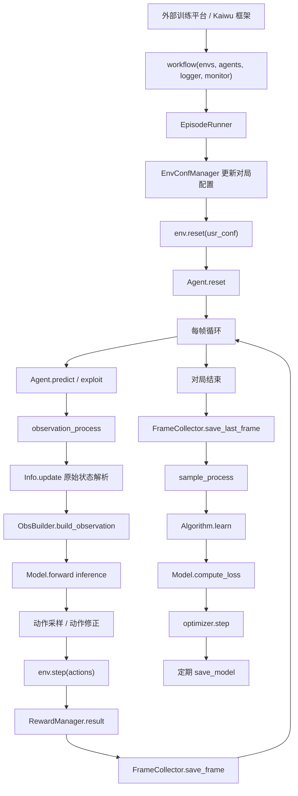
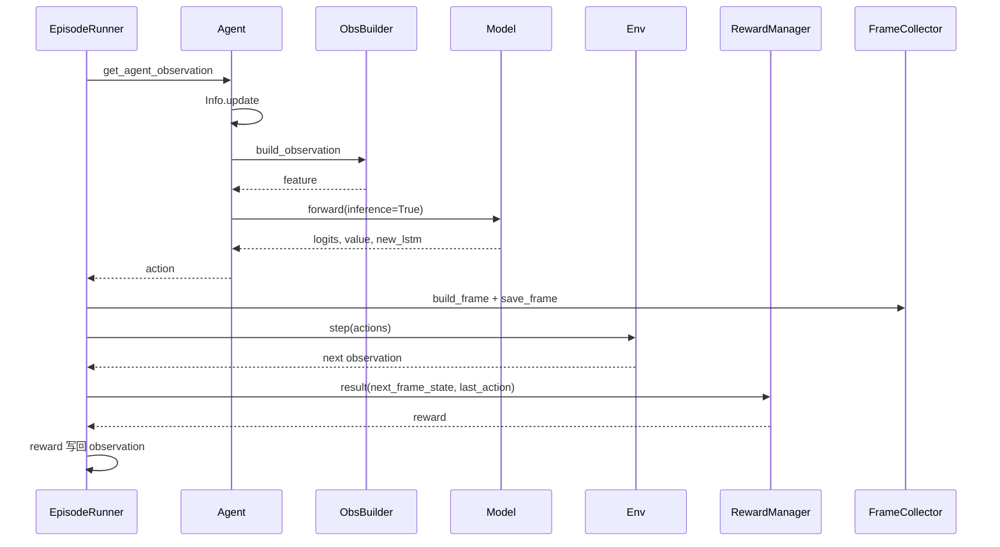
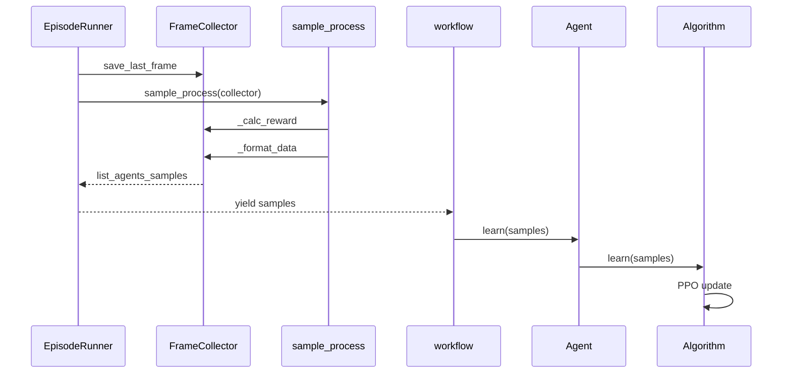

# 项目结构与工作流超详细解析

本文档用于解释当前 `agent_ppo` 项目的整体结构、模块职责、训练入口、对局工作流、Agent 推理流程、样本生成流程、学习更新流程、评估与自博弈逻辑、配置体系、调试体系以及后续改代码时应该从哪里下手。

这份文档更像一张“项目地图”。如果你想专门看神经网络内部，请看 `神经网络超详细解析.md`；如果你想专门看奖励项、奖励权重和战术奖励，请看 `奖励设计超详细解析.md`；如果你想专门看战术上下文特征，请看 `战术上下文特征说明.md`。本文会把这些模块放到完整工程流程里解释清楚。

---

## 1. 项目一句话概括

这个项目是一个用于王者荣耀 1v1 场景的 PPO 强化学习 Agent。

它的核心任务是：

1. 从游戏环境拿到一帧原始状态。
2. 把原始状态标准化成 `Info` 对象。
3. 把 `Info` 转成神经网络能读的 4078 维特征。
4. 神经网络输出 6 个动作头的 logits 和一个价值估计 value。
5. Agent 根据合法动作掩码采样动作，或在评估时取最大概率动作。
6. 环境执行动作，返回下一帧。
7. 奖励模块根据前后状态、动作、战术事件计算 reward。
8. 样本收集器把连续 16 帧打包成 LSTM PPO 训练样本。
9. 算法模块用 PPO loss 更新模型。
10. workflow 负责把上面所有步骤串成一局又一局的训练。

如果用一条主线表示，就是：

```text
环境原始状态
  -> 状态解析 Info
  -> 特征构建 ObsBuilder
  -> Agent / Model 推理
  -> 动作采样与动作后处理
  -> 环境 step
  -> 奖励计算 RewardManager
  -> FrameCollector 收集轨迹
  -> sample_process 打包样本
  -> Algorithm.learn
  -> Model.compute_loss
  -> optimizer.step
```

---

## 2. 当前项目目录总览

当前项目的主要文件结构如下：

```text
agent_ppo/
  agent.py
  __init__.py

  conf/
    __init__.py
    conf.py
    monitor_builder.py
    train_env_conf.toml

  workflow/
    __init__.py
    train_workflow.py
    env_conf_manager.py
    lineup_heros.py

  model/
    __init__.py
    model.py

  algorithm/
    __init__.py
    algorithm.py

  feature/
    __init__.py
    definition.py
    obs_builder.py
    reward_manager.py
    tactic_context.py
    unpack_state_dict.py
    evaluation_metrics.py

  utils/
    __init__.py
    display_iterable_struct.py
    dfs_iterable_struct.py
    list_rearrange.py

  debug/
    debug_agent.py

  神经网络超详细解析.md
  奖励设计超详细解析.md
  战术上下文特征说明.md
```

目录可以按职责分为 8 层：

| 层级 | 目录 / 文件 | 核心职责 |
|---|---|---|
| 训练入口层 | `workflow/train_workflow.py` | 平台调用入口；控制每局游戏、每帧推理、采样、学习、模型保存 |
| Agent 层 | `agent.py` | 对外暴露 predict、exploit、learn、save、load；连接观测、模型、动作、奖励上下文 |
| 模型层 | `model/model.py` | 神经网络结构、前向传播、PPO loss、训练/评估模式 |
| 算法层 | `algorithm/algorithm.py` | 把样本拆成张量，调用模型 loss，执行反向传播和优化器更新 |
| 特征层 | `feature/obs_builder.py`、`feature/unpack_state_dict.py`、`feature/tactic_context.py` | 原始状态解析、特征工程、战术上下文特征 |
| 奖励与样本层 | `feature/reward_manager.py`、`feature/definition.py`、`feature/evaluation_metrics.py` | 奖励计算、轨迹帧保存、GAE、样本打包、评估指标 |
| 配置层 | `conf/conf.py`、`conf/train_env_conf.toml`、`conf/monitor_builder.py` | 全局常量、环境配置、训练配置、监控面板 |
| 调试与工具层 | `debug/`、`utils/` | 规则调试 Agent、JSON 状态简化、结构遍历、距离计算等小工具 |

---

## 3. 顶层架构图

下面这张图展示的是当前项目的整体运行关系。



这个项目不是单纯的“一个模型文件”，而是一个完整的强化学习训练闭环。

模型只是其中一部分。真正让模型能学起来的是：

1. `workflow` 负责不断产生对局。
2. `Agent` 负责每帧决策。
3. `ObsBuilder` 负责把游戏状态变成特征。
4. `RewardManager` 负责告诉模型什么行为好。
5. `FrameCollector` 负责把连续轨迹变成 PPO 样本。
6. `Algorithm` 负责真正执行梯度更新。

---

## 4. 文件级结构详解

### 4.1 `agent.py`

`agent.py` 是项目里最重要的对外接口文件之一。

它定义了 `Agent` 类，这个类继承自框架提供的 `BaseAgent`。

主要职责：

1. 初始化神经网络 `Model`。
2. 初始化优化器 Adam。
3. 初始化 PPO 算法包装器 `Algorithm`。
4. 维护 LSTM 隐状态和细胞状态。
5. 处理原始 observation。
6. 调用模型推理。
7. 根据合法动作掩码采样动作。
8. 在训练时走随机动作 `predict`。
9. 在评估时走确定动作 `exploit`。
10. 保存模型。
11. 加载模型。
12. 根据英雄和对手选择召唤师技能。
13. 给连招技能添加推理偏置。
14. 记录上一帧动作，供奖励和战术上下文使用。

核心方法如下：

| 方法 | 作用 |
|---|---|
| `__init__` | 创建模型、优化器、算法器、状态缓存 |
| `init_config` | 在环境 reset 前选择召唤师技能 |
| `reset` | 每局开始时重置 LSTM、奖励管理器、状态解析器、特征构建器 |
| `observation_process` | 原始 observation -> `Info` -> 4078 维特征 -> `ObsData` |
| `_model_inference` | 批量模型推理，并生成 `ActData` |
| `predict` | 训练阶段动作接口，使用随机采样 |
| `exploit` | 评估阶段动作接口，使用最大概率动作 |
| `action_process` | 动作后处理，主要处理红方坐标方向翻转 |
| `_sample_masked_action` | 根据合法动作掩码采样 6 个动作头 |
| `_apply_combo_skill_bias` | 给优先连招技能添加 logits bonus |
| `learn` | 转发到 `Algorithm.learn` |
| `save_model` | 保存 `state_dict` |
| `load_model` | 加载 `state_dict`，支持兼容加载 |

`Agent` 可以理解为工程里的“中控适配器”。它不直接负责环境，也不直接负责 loss 细节，但它把环境观测、特征、模型、动作、奖励上下文、训练接口全部接起来。

---

### 4.2 `workflow/train_workflow.py`

`workflow/train_workflow.py` 是训练主入口。

外部训练平台会调用：

```python
workflow(envs, agents, logger=None, monitor=None, *args, **kwargs)
```

这个函数内部会创建：

```python
env_conf_manager = EnvConfManager(
    config_path="agent_ppo/conf/train_env_conf.toml",
    logger=logger,
)

episode_runner = EpisodeRunner(
    env=envs[0],
    agents=agents,
    logger=logger,
    monitor=monitor,
    env_conf_manager=env_conf_manager,
)
```

然后进入无限训练循环：

```text
for g_data in episode_runner.run_episodes():
    对每个 agent:
        如果这个 agent 需要学习，并且有样本:
            如果 agent 有 send_sample_data:
                发送样本到样本池 / learner
            否则:
                本地调用 agent.learn(samples)

    每隔 MODEL_SAVE_INTERVAL 秒:
        agents[0].save_model()
```

也就是说，`workflow` 自己并不关心神经网络细节，它关心的是：

1. 一局游戏怎么开始。
2. 一局游戏怎么循环。
3. 一局结束后怎么拿到样本。
4. 样本交给谁学习。
5. 多久保存一次模型。

---

### 4.3 `workflow/env_conf_manager.py`

`EnvConfManager` 是环境配置管理器。

它负责读取 `conf/train_env_conf.toml`，并在每局开始前动态改配置。

它主要管理：

1. 本局蓝红方英雄。
2. 本局是否评估。
3. 本局对手类型。
4. 当前监控侧。
5. 是否自动换边。
6. 评估对手池。

核心流程是：

```text
读取 train_env_conf.toml
  -> 初始化默认 opponent_agent
  -> 初始化 eval_interval
  -> 初始化 random_eval_start
  -> 初始化 monitor_side
  -> 每局 update_config
```

`update_config(lineup)` 每局做这些事：

1. 如果传入了 `lineup`，把蓝方和红方英雄写入 `usr_conf["lineups"]`。
2. 如果开启 `auto_switch_monitor_side`，每局自动切换监控侧。
3. 根据 `episode_cnt` 和 `eval_interval` 判断本局是否评估局。
4. 训练局使用默认对手。
5. 评估局从 `eval_opponent_types` 随机抽一个对手。
6. 写回 `usr_conf["episode"]["opponent_agent"]`。
7. 返回 `usr_conf, is_eval, monitor_side`。

注意一个容易忽略的细节：

```python
self.eval_interval = usr_conf["episode"]["eval_interval"] + 1
```

也就是说，配置里写 `eval_interval = 10`，代码内部实际用于取模的是 `11`。这不是文档写错，而是代码当前实际行为。

---

### 4.4 `workflow/lineup_heros.py`

`lineup_heros.py` 负责生成每局英雄阵容。

当前 `GameConfig.CAMP_HEROES` 是：

```python
CAMP_HEROES = [
    [112],
    [133],
]
```

也就是项目当前只关注两个英雄：

| hero_id | 英雄 |
|---|---|
| 112 | 鲁班七号 |
| 133 | 狄仁杰 |

`lineup_iterator_roundrobin_camp_heroes` 会做笛卡尔积：

```text
[112] x [112, 133]
[133] x [112, 133]
```

实际可能出现的 1v1 阵容是：

```text
蓝 112 vs 红 112
蓝 112 vs 红 133
蓝 133 vs 红 112
蓝 133 vs 红 133
```

每轮遍历结束后，阵容顺序会 shuffle，所以训练不会一直按固定顺序打同一组对局。

---

### 4.5 `conf/conf.py`

`conf/conf.py` 是全局常量中心。

它里面主要有 4 个类：

| 类 | 作用 |
|---|---|
| `GameConfig` | 游戏训练策略、奖励权重、调试开关、召唤师技能策略、连招偏置 |
| `Args` | 英雄、动作、实体、特征工程维度等基础参数 |
| `DimConfig` | 模型内部不同子特征的维度组织 |
| `Config` | PPO、LSTM、动作头、样本维度、学习率、折扣因子等训练参数 |

几个特别关键的配置：

| 配置 | 当前值 | 含义 |
|---|---:|---|
| `MODEL_SAVE_INTERVAL` | `1800` | 每 1800 秒保存一次模型 |
| `CAMP_HEROES` | `[[112], [133]]` | 训练轮换英雄池 |
| `LSTM_TIME_STEPS` | `16` | 每 16 帧组成一个 LSTM 训练序列 |
| `LSTM_UNIT_SIZE` | `512` | LSTM hidden/cell 维度 |
| `LABEL_SIZE_LIST` | `[12, 16, 16, 16, 16, 9]` | 6 个动作头的类别数 |
| `LEGAL_ACTION_SIZE_LIST` | `[12, 16, 16, 16, 16, 108]` | 环境原始合法动作维度，目标头是 12x9 |
| `GAMMA` | `0.995` | 折扣因子 |
| `LAMDA` | `0.95` | GAE lambda |
| `GRAD_CLIP_RANGE` | `0.5` | 梯度裁剪范围 |
| `INIT_LEARNING_RATE_START` | `1e-5` | Adam 初始学习率 |
| `SAMPLE_DIM` | `69232` | 单条训练样本最终维度 |

当前特征维度：

| 项目 | 维度 |
|---|---:|
| 实体与基础观测特征 `DIM_ENTITY` | `3935` |
| 战术上下文特征 `DIM_TACTIC` | `143` |
| 神经网络输入总维度 `DIM_ALL` | `4078` |

---

### 4.6 `conf/train_env_conf.toml`

这是环境配置文件。

它不是模型超参数文件，而是“每局游戏怎么开”的配置文件。

当前关键内容：

```toml
[monitor]
monitor_side = 0
auto_switch_monitor_side = true

[episode]
opponent_agent = "selfplay"
eval_interval = 10
eval_opponent_type = "common_ai"
eval_opponent_types = [
    "common_ai",
]

[[lineups.blue_camp]]
hero_id = 112

[[lineups.red_camp]]
hero_id = 133
```

含义如下：

| 配置 | 含义 |
|---|---|
| `monitor_side` | 监控统计默认从哪一侧看，0 蓝方，1 红方 |
| `auto_switch_monitor_side` | 是否每局自动切换监控侧 |
| `opponent_agent` | 训练局默认对手类型，当前为 selfplay |
| `eval_interval` | 评估间隔配置，代码内部会加 1 |
| `eval_opponent_type` | train_test 场景下单一评估对手 |
| `eval_opponent_types` | 普通训练下评估对手池 |
| `lineups` | 初始阵容配置，但运行时会被阵容迭代器覆盖 |

运行时，`EnvConfManager` 会修改这个配置对象，而不是每局都直接使用 TOML 里的固定英雄。

---

### 4.7 `model/model.py`

`model/model.py` 是神经网络和 PPO loss 的实现。

它定义：

| 类 / 函数 | 作用 |
|---|---|
| `Model` | Actor-Critic 主网络 |
| `MLP` | 多层感知机工具模块 |
| `make_fc_layer` | 创建全连接层 |
| `test_model` | 本地模型测试函数 |

`Model.forward` 同时服务两种场景：

1. 推理场景：`inference=True`
2. 训练场景：`inference=False`

推理时主要输出：

```text
logits
value
new_lstm_cell
new_lstm_hidden
```

训练时会结合样本中的 old policy、action、advantage、return、legal_action 等信息计算 PPO loss。

更详细的网络结构，请看 `神经网络超详细解析.md`。

---

### 4.8 `algorithm/algorithm.py`

`algorithm.py` 是 PPO 学习更新的封装。

它不设计网络结构，也不设计奖励，只做一件事：

```text
样本列表
  -> numpy / SampleData 兼容转换
  -> torch tensor
  -> 按 Config.data_shapes 拆分
  -> 拆出 feature 和 legal_action
  -> 拆出初始 LSTM hidden / cell
  -> 调 Model.forward
  -> 调 Model.compute_loss
  -> loss.backward
  -> 梯度裁剪
  -> optimizer.step
```

可以把 `Algorithm` 理解成 learner 的本地实现。

如果框架有分布式样本池，那么 `workflow` 可能会调用 `send_sample_data`；如果没有，就走本地 `agent.learn`，最后进入这里。

---

### 4.9 `feature/unpack_state_dict.py`

这个文件负责把环境返回的原始字典解析成更稳定、更容易访问的对象。

核心类是 `Info`。

`Info.update(state_dict)` 会读取：

1. frame_state
2. legal_action
3. sub_action_mask
4. heroes
5. towers
6. soldiers
7. bullets
8. cakes
9. deads
10. id2type
11. 当前己方和敌方英雄状态
12. 当前己方和敌方防御塔状态
13. 当前兵线、小兵、河蟹、血包等信息

它还封装了很多对象：

| 类 | 表示内容 |
|---|---|
| `HeroInfo` | 某一方英雄信息 |
| `ActorInfo` | 通用实体状态，例如英雄、防御塔、小兵 |
| `SkillInfo` | 技能状态集合 |
| `SlotInfo` | 单个技能槽状态 |
| `OrganInfo` | 防御塔等机关信息 |
| `SoldierInfo` | 小兵信息 |
| `CakeInfo` | 血包信息 |
| `BulletsInfo` / `BulletInfo` | 飞行物信息 |
| `DeadsInfo` / `DeadInfo` | 死亡事件信息 |
| `BuffInfo` | buff 信息 |
| `HitTargetInfo` | 命中目标信息 |

这个文件的价值在于“抗环境字段变化”。

环境状态可能有新旧 key、字符串 key、数字 key、缺失字段等问题，`unpack_state_dict.py` 用很多默认对象和 `get_first` 做了兼容。

---

### 4.10 `feature/obs_builder.py`

`ObsBuilder` 负责把 `Info` 对象变成神经网络输入向量。

当前输出是 4078 维 `np.float32` 向量。

特征来源大致分为：

1. 己方英雄特征。
2. 敌方英雄特征。
3. 己方小兵。
4. 敌方小兵。
5. 河蟹。
6. 己方防御塔。
7. 敌方防御塔。
8. 飞行物。
9. 位置编码。
10. 技能状态。
11. 金钱变化。
12. 战术上下文特征。

核心方法：

| 方法 | 作用 |
|---|---|
| `reset` | 每局重置内部历史状态 |
| `record_action` | 记录动作给战术上下文使用 |
| `process_position` | 位置特征处理 |
| `process_unit` | 通用单位特征 |
| `process_skill` | 技能槽特征 |
| `process_money` | 金钱变化特征 |
| `process_hero` | 英雄特征 |
| `process_soldier` | 小兵特征 |
| `process_river_crab` | 河蟹特征 |
| `process_sub_tower` | 防御塔特征 |
| `process_bullet` / `process_bullets` | 飞行物特征 |
| `build_observation` | 最终拼接 4078 维特征 |

`ObsBuilder` 的输出会进入 `ObsData.feature`，最终送入 `Model.forward`。

---

### 4.11 `feature/tactic_context.py`

`TacticContext` 是战术上下文特征构建器。

它不是环境原始状态里直接给出的东西，而是项目自己设计的“历史行为 + 当前局势”特征。

当前战术上下文总维度是 143。

大致包括：

| 特征组 | 作用 |
|---|---|
| combat | 战斗状态，例如距离、血量、技能可用性 |
| combo | 连招阶段、连招窗口、技能顺序 |
| lane | 兵线状态、推线状态 |
| crab | 河蟹相关局势 |
| tower | 防御塔安全、推塔状态 |
| recovery | 回血、血包、安全回复 |
| accuracy | 普攻和技能命中统计 |
| ambush | 草丛伏击相关状态 |
| luban ult | 鲁班大招危险区域相关状态 |

`Agent` 每次真正输出动作后，会调用：

```python
obs_builder.record_action(action)
```

这会把动作传给 `TacticContext`，使下一帧的特征能包含“刚才做过什么”。

---

### 4.12 `feature/reward_manager.py`

`reward_manager.py` 是奖励设计核心。

核心类是：

```python
GameRewardManager
```

每个 Agent 在每局开始时都会创建自己的 `GameRewardManager`：

```python
self.reward_manager = GameRewardManager(self.player_id, self.hero_camp)
```

每帧环境 step 后，workflow 会调用：

```python
reward = agent.reward_manager.result(
    agent_obs["frame_state"],
    last_action=agent.last_action,
)
```

这个函数会返回一个奖励字典，其中包括：

1. 每个奖励项的原始值。
2. 每个奖励项的权重。
3. 加权后的总 reward。
4. 战术奖励项。

更详细的奖励设计请看 `奖励设计超详细解析.md`。

在本文里需要重点理解的是：奖励不是在模型里算的，而是在 workflow 每帧拿到新环境状态之后算的。也就是说，奖励依赖的是“动作执行后的下一帧状态”和 `last_action`。

---

### 4.13 `feature/definition.py`

这个文件定义了强化学习轨迹和样本处理的核心结构。

重要对象：

| 名称 | 作用 |
|---|---|
| `ObsData` | Agent 处理后的观测数据，包含 feature、legal_action、lstm 状态 |
| `ActData` | 模型输出后的动作数据，包含动作、概率、value、新 LSTM 状态 |
| `Frame` | 单帧训练轨迹 |
| `SampleData` | 最终送给 learner 的样本 |
| `FrameCollector` | 每局收集轨迹、计算 GAE、打包样本 |
| `NONE_ACTION` | 不控制某一方时使用的默认动作 |

核心函数：

| 函数 | 作用 |
|---|---|
| `build_frame` | 把 Agent 当前观测和动作打成一帧训练数据 |
| `sample_process` | 调用 collector 生成训练样本 |
| `_update_legal_action` | 把环境原始 12x9 目标合法动作压缩成当前动作头对应的 9 维 |
| `SampleData2NumpyData` | SampleData -> numpy |
| `NumpyData2SampleData` | numpy -> SampleData |

这个文件是“环境交互轨迹”和“PPO 训练样本”之间的桥。

---

### 4.14 `feature/evaluation_metrics.py`

这个文件负责从 reward 原始项里抽取更可读的评估指标。

它不参与训练 loss，也不直接影响模型学习。

它用于监控这些行为倾向：

1. 空普攻。
2. 普攻命中率。
3. 技能命中率。
4. 狂暴换血。
5. 安全回城。
6. 推塔收益。
7. 草丛伏击。
8. 连招完成情况。

workflow 在每帧得到 reward 后，会调用：

```python
eval_metrics[index].observe_reward(reward)
```

对局结束后，再把这些指标上报给 monitor。

---

### 4.15 `conf/monitor_builder.py`

这个文件定义监控面板。

当前主要面板包括：

1. `reward`
2. `total_loss`
3. `value_loss`
4. `policy_loss`
5. `entropy_loss`

也就是说，项目监控重点分两类：

1. 回报是否变好。
2. PPO 训练 loss 是否稳定。

---

### 4.16 `debug/debug_agent.py`

`debug_agent.py` 提供一个规则型 DebugAgent。

当 `GameConfig.debug_agent=True` 时，workflow 不再让学习 Agent 输出动作，而是使用：

```python
DebugAgent().act(info)
```

这个规则 Agent 可以做：

1. 普攻。
2. 朝目标移动。
3. 跟随目标。
4. 释放指定技能。
5. 根据 16x16 方向网格生成动作。
6. 打印位置信息。

它主要用于验证：

1. 环境状态是否正常。
2. 动作编码是否正常。
3. 坐标方向是否正常。
4. 技能释放是否正常。
5. 调试帧保存是否正常。

---

### 4.17 `utils/`

`utils` 是小工具集合。

| 文件 | 作用 |
|---|---|
| `utils/__init__.py` | `is_iterable`、`show_iter`、`get_dist` |
| `utils/display_iterable_struct.py` | 简化复杂嵌套结构，保存 JSON 调试文件 |
| `utils/dfs_iterable_struct.py` | 深度遍历嵌套 list/dict 并应用函数 |
| `utils/list_rearrange.py` | 根据英雄顺序重排 list，并支持 inverse 还原 |

这些文件不是训练主流程的核心，但在状态调试、结构展示、距离计算、列表重排时会用到。

---

## 5. 完整训练工作流

这一节按真实代码执行顺序解释。

### 5.1 外部平台调用 `workflow`

训练从这里开始：

```python
def workflow(envs, agents, logger=None, monitor=None, *args, **kwargs):
```

平台会传入：

| 参数 | 含义 |
|---|---|
| `envs` | 环境列表，当前代码使用 `envs[0]` |
| `agents` | Agent 列表，1v1 通常是两个 Agent |
| `logger` | 日志对象 |
| `monitor` | 监控上报对象 |

workflow 内部先设定：

```python
do_learns = [True, True]
```

表示两边 Agent 默认都可以学习。

但注意，这只是外层学习开关。实际每局、每个阵营是否采样，还会被 `reset_agents` 根据对手类型覆盖。

---

### 5.2 创建环境配置管理器

workflow 创建：

```python
EnvConfManager(config_path="agent_ppo/conf/train_env_conf.toml")
```

它会读取 TOML，然后准备每局动态配置。

此时会确定：

1. 默认对手是不是 selfplay。
2. 评估间隔是多少。
3. 评估对手池有哪些。
4. 监控侧是哪边。
5. 是否自动换边。

---

### 5.3 创建 EpisodeRunner

`EpisodeRunner` 是真正跑一局游戏的对象。

初始化时会做这些事：

1. 保存 env。
2. 保存 agents。
3. 保存 logger 和 monitor。
4. 保存 env_conf_manager。
5. 记录 agent 数量。
6. 初始化 episode 计数器。
7. 初始化 predict 成功计数器。
8. 初始化模型加载成功计数器。
9. 创建阵容迭代器。
10. 如果开启 debug_agent，创建两个 DebugAgent。

阵容迭代器来自：

```python
lineup_iterator_roundrobin_camp_heroes(GameConfig.CAMP_HEROES)
```

---

### 5.4 外层无限循环

workflow 的主体是：

```text
while True:
    从 episode_runner.run_episodes() 里不断拿一局结束后的样本
    有样本就学习或发送样本
    到时间就保存模型
```

`EpisodeRunner.run_episodes()` 自己也是一个生成器。

它会一局一局跑游戏，每局结束时 `yield list_agents_samples`。

所以项目里有两层循环：

```text
workflow 外层循环:
    不停消费 episode_runner 产出的样本

EpisodeRunner 内层循环:
    不停开新局
        每局内部再按帧循环
```

---

## 6. 每局游戏开始前的工作流

每局开始前，`EpisodeRunner.run_episodes()` 会先准备本局配置。

### 6.1 获取训练指标

代码会调用：

```python
training_metrics = get_training_metrics()
```

并把训练指标写日志。

这些指标通常来自平台或训练框架，用于了解当前训练状态。

---

### 6.2 更新环境配置

每局都会取下一个阵容：

```python
lineup = next(self.lineup_iter)
```

然后：

```python
usr_conf, is_eval, monitor_side = self.env_conf_manager.update_config(lineup)
```

这一步会同时决定：

1. 蓝方英雄。
2. 红方英雄。
3. 是否评估局。
4. 本局对手类型。
5. 本局监控侧。

---

### 6.3 注入召唤师技能

代码会调用：

```python
self._call_init_config(usr_conf)
```

这一步内部会：

1. 从 `usr_conf` 里提取蓝红方 hero_id。
2. 分别构造每个 Agent 看到的 `my_heroes` 和 `opponent_heroes`。
3. 调用 `agent.init_config(config_data)`。
4. Agent 根据英雄和敌方英雄选择召唤师技能。
5. 再把技能写回 `usr_conf`。

当前 `GameConfig.select_summoner_skill` 的策略比较简单：

```text
当前所有英雄和对局都选择 frenzy
```

也就是狂暴。

---

### 6.4 reset 环境

配置准备好后，进入：

```python
observation, extra_info = env.reset(usr_conf=usr_conf)
```

环境返回：

| 返回值 | 含义 |
|---|---|
| `observation` | 初始观测 |
| `extra_info` | 额外信息，包含灾难恢复相关 result_code |

代码中还有 `_normalize_reset_result`，用于兼容不同环境 reset 返回格式。

---

### 6.5 灾难恢复检查

reset 后会检查：

```python
self._handle_disaster_recovery(extra_info)
```

当前逻辑是：

1. `result_code < 0`：认为严重异常，直接 raise。
2. `result_code > 0`：认为需要跳过当前异常局。
3. `result_code == 0` 或不存在：正常继续。

这让训练循环能对环境异常做基本保护。

---

### 6.6 可选保存调试帧

如果：

```python
GameConfig.debug_frames = True
```

则会保存当前 observation 到：

```text
debug/frames/
```

保存时会生成 raw 和 simplified 两类 JSON，方便检查环境返回结构。

---

### 6.7 reset Agent

接着执行：

```python
self.reset_agents(observation)
```

这一步非常关键，它会决定每个 Agent 本局：

1. 是否需要预测动作。
2. 是否需要采样。
3. 是否加载最新模型。
4. 是否加载对手模型。
5. 是否交给 common_ai。

默认：

```python
do_predicts = [True, True]
do_samples = [True, True]
```

然后根据 `monitor_side` 和 `opponent_agent` 调整。

---

## 7. `reset_agents` 的对手与采样逻辑

`reset_agents` 的核心输入是：

1. 当前 observation。
2. `monitor_side`。
3. `opponent_agent`。

### 7.1 monitor_side 的含义

`monitor_side` 表示当前主训练/监控侧。

如果 `monitor_side = 0`，通常蓝方是主侧。

如果 `monitor_side = 1`，通常红方是主侧。

代码里：

```python
if i == monitor_side:
    agent.load_model(id="latest")
```

也就是说，主侧会加载最新模型。

---

### 7.2 对手是 `common_ai`

如果某一侧不是 monitor_side，且对手类型是：

```python
opponent_agent == "common_ai"
```

则代码会设置：

```python
do_predicts[i] = False
do_samples[i] = False
```

含义是：

1. 这一侧不由当前 Agent 预测。
2. 这一侧不收集训练样本。
3. 这一侧动作使用 `NONE_ACTION`，实际控制交给环境内置 common_ai 或平台规则。

---

### 7.3 对手是 `selfplay`

如果对手类型是：

```python
opponent_agent == "selfplay"
```

则对手侧也会：

```python
agent.load_model(id="latest")
```

含义是双方都用当前最新模型打。

这就是自博弈。

这种情况下，对手侧通常也可以预测，也可以采样。

---

### 7.4 对手是自定义模型 ID

如果 `opponent_agent` 既不是 `common_ai`，也不是 `selfplay`，则会被当作模型 ID。

大致逻辑是：

1. 如果是 `train_test` 模式，加载 latest。
2. 否则检查模型池中是否存在该模型。
3. 调用 `load_opponent_agent(id=opponent_agent)`。
4. 对手侧 `do_samples[i] = False`。

当前 `Agent.load_opponent_agent` 在代码里是空实现：

```python
pass
```

这通常意味着：

1. 这个能力可能由训练平台接管。
2. 或者当前本地版本还没有实现自定义对手模型加载。

因此如果后面要真正支持“指定模型 ID 做对手”，这里是一个需要关注的扩展点。

---

### 7.5 每个 Agent 自身 reset

最后，无论是否预测、是否采样，都会调用：

```python
agent.reset(get_agent_observation(observation, i))
```

Agent 在 reset 时会：

1. 确定自己的 camp。
2. 确定自己的 player_id。
3. 清空 LSTM hidden。
4. 清空 LSTM cell。
5. 创建新的 `GameRewardManager`。
6. 重置 `Info`。
7. 重置 `ObsBuilder`。
8. 清空 `last_action`。

---

## 8. 每帧循环工作流

每局 reset 完成后，就进入每帧循环。

简化版本如下：

```text
while True:
    准备默认 actions
    对每个 agent:
        如果需要预测:
            取该 agent 的 observation
            如果训练局:
                action = agent.predict(agent_obs)
            如果评估局:
                action = agent.exploit(agent_obs)
            如果训练局且需要采样:
                frame = build_frame(agent, agent_obs)
                frame_collector.save_frame(frame)

    frame_no, observation, terminated, truncated, extra_info = env.step(actions)

    对每个需要采样的 agent:
        根据新 observation 计算 reward
        reward 写回 agent_obs
        更新评估指标

    如果对局结束:
        保存最后一帧 reward
        打包样本
        yield samples
```

这一段是项目最核心的交互闭环。

---

### 8.1 默认动作 `NONE_ACTION`

每帧开始时：

```python
actions = [NONE_ACTION] * self.agent_num
```

`NONE_ACTION` 定义在 `feature/definition.py`：

```python
NONE_ACTION = [0, 15, 15, 15, 15, 0]
```

如果某个 Agent 不需要预测，比如 common_ai 对手侧，它就保持默认动作。

---

### 8.2 debug_agent 分支

如果：

```python
GameConfig.debug_agent = True
```

则 workflow 会使用 `DebugAgent`：

```python
actions[index] = self.debug_agents[index].act(self.debug_infos[index])
```

这种模式下，学习 Agent 的模型推理会被绕过，主要用于动作和环境调试。

---

### 8.3 普通训练推理分支

普通训练时，每个需要预测的 Agent 会做：

```python
agent_obs = self.get_agent_observation(observation, index)
actions[index] = agent.predict(agent_obs)
```

`predict` 的特点是：

1. 使用模型推理。
2. 根据概率分布随机采样动作。
3. 会保存 `obs_data` 和 `act_data`。
4. 会更新 LSTM 状态。
5. 会记录本次动作到战术上下文。

训练时必须有随机性，因为 PPO 需要探索。

---

### 8.4 评估推理分支

如果本局是评估局：

```python
actions[index] = agent.exploit(agent_obs)
```

`exploit` 的特点是：

1. 使用模型推理。
2. 每个动作头取合法动作中的最大概率动作。
3. 不做训练采样。
4. 更接近“当前模型真实水平”的展示。

---

### 8.5 训练帧构建

如果不是评估局，而且当前 Agent 需要采样：

```python
frame = build_frame(agent, agent_obs)
frame_collector.save_frame(frame, agent_id=index)
```

这里有一个强化学习里很重要的时间对齐问题。

`build_frame` 发生在 `env.step` 之前。

也就是说，这一帧保存的是：

1. 当前状态特征。
2. 当前合法动作。
3. 当前动作。
4. 当前动作概率。
5. 当前 value。
6. 当前 LSTM 状态。

但是 reward 是动作执行之后才知道的。

所以当前 frame 先保存下来，等下一帧 reward 算出来后，再由 `FrameCollector.save_frame` 把 reward 对齐到上一帧。

---

### 8.6 执行环境 step

动作列表准备好后，调用：

```python
frame_no, observation, terminated, truncated, extra_info = env.step(actions)
```

返回：

| 返回值 | 含义 |
|---|---|
| `frame_no` | 当前帧号 |
| `observation` | step 后的新状态 |
| `terminated` | 是否自然结束 |
| `truncated` | 是否被截断 |
| `extra_info` | 额外信息 |

代码也有 `_normalize_step_result` 来兼容不同 step 返回格式。

---

### 8.7 step 后计算奖励

环境 step 后，workflow 对每个需要采样的 Agent 做：

```python
agent_obs = get_agent_observation(observation, index)
reward = agent.reward_manager.result(
    agent_obs["frame_state"],
    last_action=agent.last_action,
)
agent_obs["reward"] = reward
```

这里的重点是：

1. reward 使用的是 step 后的新状态。
2. reward 同时拿到了上一帧实际执行动作 `last_action`。
3. reward 被写回当前 observation。
4. 下一次 `build_frame` 或 `save_last_frame` 会使用这些 reward。

---

### 8.8 评估指标更新

每帧 reward 算完后，会调用：

```python
eval_metrics[index].observe_reward(reward)
```

这些指标会累计到对局结束。

它们主要是为了监控模型行为质量，不直接参与反向传播。

---

### 8.9 对局结束判断

一局结束条件是：

```python
terminated or truncated or (
    is_train_test and frame_no >= GameConfig.debug_total_frames
)
```

含义：

1. 环境自然结束。
2. 环境截断。
3. train_test 调试模式下达到指定帧数。

---

### 8.10 对局结束后保存最后 reward

对局结束时，如果是训练局，会调用：

```python
frame_collector.save_last_frame(reward, agent_id=index)
```

因为最后一个动作之后没有下一帧可用于普通 `save_frame` 对齐，所以需要单独把终局 reward 填到最后一个 frame 里。

---

### 8.11 对局结束后生成样本

如果收集器里有数据，且不是评估局：

```python
list_agents_samples = sample_process(frame_collector)
yield list_agents_samples
```

这样 `EpisodeRunner` 就把一局游戏的训练数据交回了 workflow 外层。

---

## 9. Agent 内部工作流

这一节展开 `Agent.predict` 和 `Agent.exploit` 内部发生了什么。

### 9.1 训练动作 `predict`

`predict` 的流程是：

```text
observation_process
  -> _model_inference
  -> update_status
  -> action_process(is_stochastic=True)
  -> last_action = action
  -> obs_builder.record_action(action)
  -> return action
```

拆开看：

1. `observation_process` 把原始 observation 转成 `ObsData`。
2. `_model_inference` 调模型，得到 `ActData`。
3. `update_status` 保存当前 `obs_data` 和 `act_data`，并更新 LSTM。
4. `action_process` 从 `ActData` 取随机动作，并处理红方方向翻转。
5. `last_action` 记录动作，供 reward 使用。
6. `obs_builder.record_action` 记录动作，供战术特征使用。

---

### 9.2 评估动作 `exploit`

`exploit` 流程几乎一样：

```text
observation_process
  -> _model_inference
  -> update_status
  -> action_process(is_stochastic=False)
  -> last_action = action
  -> obs_builder.record_action(action)
  -> return action
```

区别在于 `action_process` 会拿确定性动作。

确定性动作来自每个动作头合法动作中的最大概率项。

---

### 9.3 observation_process

这一步是：

```python
self.info.update(observation)
feature = self.obs_builder.build_observation(self.info)
return ObsData(
    feature=feature,
    legal_action=observation["legal_action"],
    lstm_cell=self.lstm_cell,
    lstm_hidden=self.lstm_hidden,
)
```

也就是说，一个 `ObsData` 里包含：

| 字段 | 含义 |
|---|---|
| `feature` | 4078 维神经网络输入 |
| `legal_action` | 环境给出的合法动作掩码 |
| `lstm_cell` | 当前 LSTM cell |
| `lstm_hidden` | 当前 LSTM hidden |

---

### 9.4 _model_inference

`_model_inference` 支持 batch 推理。

它会把多个 `ObsData` 整理成：

```python
format_inputs = [
    feature_tensor,
    lstm_hidden_tensor,
    lstm_cell_tensor,
]
```

其中：

| 输入 | shape 意义 |
|---|---|
| feature | `[-1, 4078]` |
| lstm_hidden | `[-1, 512]` |
| lstm_cell | `[-1, 512]` |

然后：

```python
self.model.set_eval_mode()
logits, value, new_lstm_cell, new_lstm_hidden = self.model(
    format_inputs,
    inference=True,
)
```

推理结束后，每个 observation 会进入动作采样。

---

### 9.5 合法动作采样

模型输出的 `logits` 会按动作头拆分：

```python
LABEL_SIZE_LIST = [12, 16, 16, 16, 16, 9]
```

6 个动作头可以理解为：

| 头 | 类别数 | 含义 |
|---|---:|---|
| action type | 12 | 顶层动作按钮 |
| move x / dir 1 | 16 | 方向或参数 |
| move z / dir 2 | 16 | 方向或参数 |
| skill x / dir 1 | 16 | 技能方向或参数 |
| skill z / dir 2 | 16 | 技能方向或参数 |
| target | 9 | 目标选择 |

环境给的合法动作掩码是：

```python
LEGAL_ACTION_SIZE_LIST = [12, 16, 16, 16, 16, 108]
```

最后一个 108 是：

```text
12 个顶层动作 x 每个顶层动作 9 个目标
```

采样时会先采前 5 个动作头，再根据第 1 个动作头选中的 action type，从 12x9 目标掩码里取对应的 9 维目标合法掩码。

这就是 `_sample_masked_action` 做的事情。

---

### 9.6 为什么目标头要特殊处理

目标选择不是独立的。

例如：

1. 普攻可以打英雄、小兵、防御塔。
2. 移动动作可能不需要目标。
3. 某些技能能选敌方英雄。
4. 某些技能可能只能朝方向释放。

所以目标合法性依赖顶层动作。

项目里用 12x9 的方式表达这种依赖：

```text
如果 action_type = 0，则用第 0 行目标 mask
如果 action_type = 1，则用第 1 行目标 mask
...
如果 action_type = 11，则用第 11 行目标 mask
```

模型只输出 9 维 target logits，但采样时会根据 action_type 选择对应 mask。

---

### 9.7 红方动作方向翻转

`action_process` 里有一个重要逻辑：

```python
if self.hero_camp == 1:
    for i in range(1, 5):
        if action[i] > 0:
            action[i] = 16 - action[i]
```

含义是：

1. 蓝方和红方在地图坐标上方向相反。
2. 模型内部尽量使用统一视角学习。
3. 真正发给环境前，红方需要把方向参数翻转。

这可以减少模型同时学习两套镜像行为的难度。

---

### 9.8 LSTM 状态更新

模型每次推理会输出新的：

```text
new_lstm_cell
new_lstm_hidden
```

`Agent.update_status` 会保存它们：

```python
self.lstm_cell = act_data.lstm_cell
self.lstm_hidden = act_data.lstm_hidden
```

下一帧 `observation_process` 会把新的 LSTM 状态放进 `ObsData`。

这样模型就能记住短期历史，而不只是看单帧状态。

---

### 9.9 连招技能推理偏置

`Agent._apply_combo_skill_bias` 会在推理时给某些技能 logits 增加 bonus。

大致逻辑：

1. 判断敌方英雄是否可见、存活。
2. 判断距离是否进入紧急技能距离。
3. 判断自己是否处在敌方存活防御塔范围内。
4. 根据英雄 ID 查技能优先级。
5. 如果技能合法且可用，就给对应动作按钮加 logit bonus。
6. 如果该技能可以合法选敌方英雄为目标，就给目标头的敌方英雄目标加 logit bonus。

这不是训练 loss，而是推理阶段的策略偏置。

它的作用是把一些明确的战术先验注入策略，尤其是连招和技能释放优先级。

---

## 10. 状态与特征流

### 10.1 原始 observation 的位置

workflow 从环境拿到的 `observation` 可能是：

1. list 格式。
2. dict 格式，key 是整数。
3. dict 格式，key 是字符串。

所以 `EpisodeRunner.get_agent_observation` 做了兼容：

```text
如果 observation 是 dict:
    优先取 observation[index]
    再取 observation[str(index)]
否则:
    直接 observation[index]
```

这样可以兼容不同环境封装。

---

### 10.2 原始 observation 到 Info

`Agent.observation_process` 调用：

```python
self.info.update(observation)
```

这一步会读取并标准化：

1. 己方英雄。
2. 敌方英雄。
3. 己方塔。
4. 敌方塔。
5. 小兵。
6. 河蟹。
7. 血包。
8. 飞行物。
9. 技能状态。
10. buff 状态。
11. 死亡事件。
12. 合法动作。

经过这一步之后，后续代码就不需要频繁从深层 dict 里取 key。

---

### 10.3 Info 到 4078 维 feature

`ObsBuilder.build_observation(info)` 会把对象化的状态拼成一个长向量。

当前总维度：

```text
DIM_ALL = DIM_ENTITY + DIM_TACTIC
        = 3935 + 143
        = 4078
```

其中：

| 部分 | 维度 | 来源 |
|---|---:|---|
| `DIM_ENTITY` | 3935 | 英雄、小兵、防御塔、河蟹、飞行物、技能、位置等 |
| `DIM_TACTIC` | 143 | `TacticContext` 产生的战术上下文 |

`ObsBuilder` 内部最后会做 assert，确保拼出来的维度与配置一致。

---

### 10.4 feature 到 ObsData

最终 `observation_process` 返回：

```python
ObsData(
    feature=feature,
    legal_action=observation["legal_action"],
    lstm_cell=self.lstm_cell,
    lstm_hidden=self.lstm_hidden,
)
```

`ObsData` 是模型推理的输入包装。

---

### 10.5 ObsData 到模型输入

`_model_inference` 会把 `ObsData` 批量转成 torch tensor：

```text
feature -> torch.float32 -> [-1, 4078]
lstm_hidden -> torch.float32 -> [-1, 512]
lstm_cell -> torch.float32 -> [-1, 512]
```

然后送入模型。

---

## 11. 动作流

### 11.1 模型输出动作概率

模型输出的是 logits，不是最终动作。

logits 按动作头拆成：

```text
12 + 16 + 16 + 16 + 16 + 9 = 85
```

也就是总 policy 输出维度是 85。

---

### 11.2 合法动作 mask

环境同时给出 legal_action。

合法动作掩码用于保证模型不会选非法动作。

处理方式是：

1. 对非法动作加巨大负数或让概率接近 0。
2. 对合法动作做 softmax。
3. 训练时按概率采样。
4. 评估时取最大概率。

---

### 11.3 训练动作和评估动作同时保存

`_sample_masked_action` 会同时生成：

1. `action`：随机采样动作。
2. `d_action`：确定性最大概率动作。
3. `prob`：随机动作对应概率。
4. `d_prob`：确定性动作对应概率。

训练 `predict` 使用 `action`。

评估 `exploit` 使用 `d_action`。

---

### 11.4 动作发给环境

最终每个 Agent 返回一个长度为 6 的动作：

```text
[button, move_x, move_z, skill_x, skill_z, target]
```

workflow 把两个 Agent 的动作组成列表：

```text
actions = [
    blue_action,
    red_action,
]
```

然后传给：

```python
env.step(actions)
```

---

## 12. 奖励流

### 12.1 奖励计算发生的位置

奖励不在 `Agent.predict` 里算。

奖励也不在 `Model.forward` 里算。

奖励发生在环境执行动作之后：

```text
Agent 输出动作
  -> env.step(actions)
  -> 得到下一帧 observation
  -> RewardManager.result(next_frame_state, last_action)
```

这符合强化学习里的基本时序：

```text
s_t, a_t -> s_{t+1}, r_t
```

---

### 12.2 reward 写回 observation

workflow 算完 reward 后：

```python
agent_obs["reward"] = reward
```

这样后面 `build_frame` 或 `save_last_frame` 就能取到 reward。

---

### 12.3 reward_sum

`build_frame` 使用：

```python
reward = observation["reward"]["reward_sum"]
```

也就是说，真正进入训练轨迹的是加权后的总奖励。

但是监控和调试时仍然可以看每个奖励项的明细。

---

### 12.4 reward 与 last_action

`RewardManager.result` 接收：

```python
last_action=agent.last_action
```

这非常重要。

很多战术奖励不能只看当前状态，还必须知道上一帧做了什么。

例如：

1. 上一帧是否普攻。
2. 上一帧是否放技能。
3. 上一帧是否开狂暴。
4. 上一帧是否试图打敌方英雄。
5. 上一帧是否在危险距离内做了错误动作。

所以 `last_action` 是奖励设计的一部分。

---

## 13. 轨迹收集与样本生成

### 13.1 为什么需要 FrameCollector

PPO 不能只用单帧训练。

它需要一段轨迹，至少包括：

1. 状态。
2. 动作。
3. 动作概率。
4. 奖励。
5. value。
6. next_value。
7. advantage。
8. return。
9. LSTM 初始状态。

`FrameCollector` 就负责保存这些信息。

---

### 13.2 build_frame 保存了什么

`build_frame(agent, observation)` 会生成一个 `Frame`。

核心字段包括：

| 字段 | 含义 |
|---|---|
| `frame_no` | 帧号 |
| `feature` | 4078 维特征 |
| `legal_action` | 当前动作对应的合法动作 |
| `action` | 实际采样动作 |
| `reward` | 当前 reward |
| `reward_sum` | 累计回报，后续计算 |
| `value` | 当前状态 value |
| `next_value` | 下一状态 value，后续填入 |
| `advantage` | GAE 结果，后续计算 |
| `prob` | 行为策略概率 |
| `sub_action` | 子动作 mask |
| `lstm_cell` | 当前 LSTM cell |
| `lstm_hidden` | 当前 LSTM hidden |
| `is_train` | 当前帧是否用于训练 |

---

### 13.3 reward 如何对齐到上一帧

`FrameCollector.save_frame` 有一个容易忽略但非常关键的逻辑：

当新 frame 到来时，它会把新 frame 里的 reward 写给上一帧。

原因是：

```text
上一帧动作 a_t 执行后
下一帧才知道 reward r_t
```

所以 reward 应该属于上一帧动作，而不是当前帧动作。

这个对齐关系是强化学习样本正确性的关键。

---

### 13.4 reward clipping

`FrameCollector.save_frame` 会对 reward 做裁剪：

```python
clip(reward, min=-100, max=100)
```

目的：

1. 防止极端奖励导致 advantage 爆炸。
2. 增加训练稳定性。
3. 降低单帧异常奖励对 PPO 更新的冲击。

---

### 13.5 GAE 计算

对局结束后，`FrameCollector._calc_reward` 会反向计算：

```text
delta_t = reward_t + gamma * next_value_t - value_t
advantage_t = delta_t + gamma * lambda * advantage_{t+1}
return_t = advantage_t + value_t
```

当前配置：

```text
gamma = 0.995
lambda = 0.95
```

GAE 的作用是平衡：

1. 高方差的 Monte Carlo 回报。
2. 有偏但稳定的 TD 估计。

---

### 13.6 LSTM 序列打包

项目按：

```python
Config.LSTM_TIME_STEPS = 16
```

每 16 帧打包成一个训练样本。

打包时，每条样本包含：

1. 连续 16 帧的 per-frame 数据。
2. 这段序列开始时的 LSTM cell。
3. 这段序列开始时的 LSTM hidden。

当前单条样本最终维度是：

```text
SAMPLE_DIM = 69232
```

其中：

```text
每帧数据合计 4263 维
16 帧共 4263 * 16 = 68208
LSTM cell + hidden = 512 + 512 = 1024
最终 68208 + 1024 = 69232
```

---

### 13.7 为什么样本里要存 old probability

PPO 的核心不是普通 policy gradient，而是 clipped policy gradient。

它需要比较：

```text
new_policy_prob / old_policy_prob
```

所以在采样时必须保存当时模型选择动作的概率。

这个概率就是 `Frame.prob`。

训练时模型重新前向，得到新概率，再和旧概率计算 ratio。

---

## 14. 学习更新工作流

### 14.1 workflow 拿到样本

`EpisodeRunner` yield 出：

```python
list_agents_samples
```

它一般是一个 list：

```text
[
    blue_agent_samples,
    red_agent_samples,
]
```

每个元素是对应 Agent 的样本列表。

---

### 14.2 本地学习或发送样本

workflow 对每个 Agent 做：

```text
如果 do_learn=True 且样本非空:
    如果 agent 有 send_sample_data:
        agent.send_sample_data(samples)
    否则:
        agent.learn(samples)
```

这兼容两种训练方式：

1. 本地单进程学习。
2. 框架托管的分布式样本池 / learner。

---

### 14.3 Agent.learn

`Agent.learn` 很简单：

```python
return self.algorithm.learn(list_sample_data)
```

真正学习逻辑在 `Algorithm`。

---

### 14.4 Algorithm.learn

`Algorithm.learn` 的详细流程：

```text
输入 list_sample_data
  -> 兼容 SampleData / numpy / npdata
  -> stack 成 batch
  -> 转 torch tensor
  -> 按 Config.data_shapes 切分
  -> seri_vec 再拆成 feature 和 legal_action
  -> 取最后两个字段作为初始 LSTM state
  -> model.set_train_mode()
  -> model.forward(inference=False)
  -> model.compute_loss
  -> optimizer.zero_grad
  -> loss.backward
  -> grad clip
  -> optimizer.step
```

---

### 14.5 训练输入和推理输入的区别

推理输入只有：

```text
feature
lstm_hidden
lstm_cell
```

训练输入除了这些，还需要：

1. legal_action。
2. action。
3. old probability。
4. advantage。
5. return。
6. reward。
7. old value。
8. sub_action。
9. is_train。
10. LSTM 序列维度。

也就是说，训练不是“给模型一个状态让它输出动作”这么简单，而是要复现当时采样动作，并计算 PPO 目标函数。

---

### 14.6 loss 上报

`Algorithm.learn` 每隔一段时间会把 loss 上报给 monitor：

1. total_loss
2. value_loss
3. policy_loss
4. entropy_loss

这些指标帮助判断训练是否稳定。

---

## 15. 评估工作流

### 15.1 什么时候进入评估

每局开始时，`EnvConfManager.update_config` 会判断：

```python
is_eval = (episode_cnt + random_eval_start) % eval_interval == 0
```

其中 `random_eval_start` 是随机起点。

作用是避免多个训练进程在完全相同局数同时评估。

---

### 15.2 评估时动作怎么选

评估局使用：

```python
agent.exploit(agent_obs)
```

它会选确定性动作，也就是每个动作头选择最大概率合法动作。

---

### 15.3 评估时是否采样

评估局不生成训练样本。

代码里对采样的判断是：

```python
if not is_eval and do_sample:
    build_frame(...)
```

对局结束时也是：

```python
if len(frame_collector) > 0 and not is_eval:
    yield samples
```

这避免评估局数据污染训练。

---

### 15.4 评估指标上报

评估局仍然会计算 reward 和 metrics。

这些数据用于 monitor，帮助看模型实际行为。

例如：

1. 技能命中率有没有提高。
2. 空普攻有没有减少。
3. 推塔行为有没有变好。
4. 连招完成度有没有提高。

---

## 16. 自博弈与对手逻辑

### 16.1 为什么需要自博弈

1v1 强化学习里，如果一直打固定规则 AI，模型容易学到针对这个 AI 的特殊策略。

自博弈可以让模型面对“同水平或近似同水平”的对手，逐步提升策略强度。

当前训练配置：

```toml
opponent_agent = "selfplay"
```

所以默认训练局是自博弈。

---

### 16.2 selfplay 的当前实现

自博弈时，两边都加载：

```python
agent.load_model(id="latest")
```

这表示双方都使用当前最新模型。

如果两边都开启采样，那么双方轨迹都可以进入训练。

---

### 16.3 common_ai 的角色

评估默认对手是：

```toml
eval_opponent_types = [
    "common_ai",
]
```

这意味着评估时经常会用规则 AI 作为基准。

这样可以回答一个现实问题：

```text
当前训练出来的模型，打内置规则 AI 表现怎么样？
```

---

### 16.4 custom model id

TOML 里注释了很多历史模型 ID。

这些模型 ID 可以作为评估或训练对手。

不过当前本地 `Agent.load_opponent_agent` 是空实现，所以如果要完整启用，通常需要依赖平台，或者自己补充模型池加载逻辑。

---

## 17. 模型保存与加载

### 17.1 保存模型

workflow 每隔：

```python
GameConfig.MODEL_SAVE_INTERVAL = 1800
```

会调用：

```python
agents[0].save_model()
```

`Agent.save_model` 内部保存：

```python
torch.save(self.model.state_dict(), model_file_path)
```

文件名格式：

```text
model.ckpt-{id}.pkl
```

---

### 17.2 加载模型

`Agent.load_model(path, id)` 会加载：

```text
{path}/model.ckpt-{id}.pkl
```

然后：

```python
self.model.load_state_dict(model_state_dict)
```

---

### 17.3 兼容加载

如果模型结构发生变化，直接 `load_state_dict` 可能失败。

当前代码有 `_load_compatible_state_dict`，它会：

1. 遍历 checkpoint 中的参数。
2. 只加载当前模型里存在且 shape 一致的参数。
3. 跳过不兼容参数。
4. 打印 warning。

这对微调结构很有帮助。

例如你加了一个小模块，旧 checkpoint 不能完全匹配，但大部分旧参数仍然能加载。

---

## 18. 调试工作流

### 18.1 debug_agent

把：

```python
GameConfig.debug_agent = True
```

打开后，workflow 会使用规则动作。

适合调试：

1. 动作格式。
2. 技能方向。
3. 普攻目标。
4. 环境状态解析。
5. 坐标系。

---

### 18.2 debug_frames

把：

```python
GameConfig.debug_frames = True
```

打开后，会保存环境帧。

保存目录：

```text
debug/frames/
```

保存内容包括：

1. raw observation。
2. simplified observation。

这对理解环境状态结构非常有用。

---

### 18.3 train_test

`GameConfig.is_train_test` 用于限制调试帧数。

如果开启：

```python
frame_no >= GameConfig.debug_total_frames
```

就可以提前结束一局。

这适合快速跑通流程，而不用等待完整对局。

---

## 19. 监控体系

### 19.1 训练侧监控

workflow 会周期性上报：

1. 预测成功次数。
2. 模型加载成功次数。
3. reward。
4. loss。
5. 行为评估指标。

---

### 19.2 reward 监控

reward 监控既可以看总 reward，也可以看具体奖励项。

对调奖励非常重要，因为总 reward 上升不一定代表行为真的健康。

例如：

1. 总 reward 上升，但空普攻也上升，说明奖励可能有偏。
2. 推塔 reward 上升，但死亡也上升，说明模型可能过度激进。
3. 技能命中率下降，但战斗 reward 上升，说明可能学到了只普攻的策略。

---

### 19.3 loss 监控

loss 监控包括：

| 指标 | 含义 |
|---|---|
| `total_loss` | 总损失 |
| `value_loss` | critic 价值损失 |
| `policy_loss` | actor 策略损失 |
| `entropy_loss` | 熵正则损失 |

常见现象：

1. `value_loss` 长期很大：价值估计跟回报差距大。
2. `policy_loss` 剧烈震荡：策略更新可能过猛。
3. `entropy_loss` 太小：探索不足。
4. 总 loss 下降但 reward 不涨：奖励、采样或 value 可能存在问题。

---

## 20. 数据结构总览

### 20.1 ObsData

`ObsData` 表示模型推理前的数据。

字段：

| 字段 | 含义 |
|---|---|
| `feature` | 4078 维输入特征 |
| `legal_action` | 原始合法动作掩码 |
| `lstm_cell` | 当前 LSTM cell |
| `lstm_hidden` | 当前 LSTM hidden |

---

### 20.2 ActData

`ActData` 表示模型推理后的动作数据。

字段：

| 字段 | 含义 |
|---|---|
| `action` | 随机采样动作 |
| `d_action` | 确定性动作 |
| `prob` | 随机动作概率 |
| `d_prob` | 确定性动作概率 |
| `value` | 当前状态价值估计 |
| `lstm_cell` | 新 LSTM cell |
| `lstm_hidden` | 新 LSTM hidden |

---

### 20.3 Frame

`Frame` 是一帧训练轨迹。

它把 observation、action、reward、value、prob、legal_action、LSTM 状态放在一起。

可以理解为 PPO 训练所需的最小时间步单元。

---

### 20.4 SampleData

`SampleData` 是打包后的训练样本。

每条样本包含 16 帧序列和初始 LSTM 状态。

它是最终进入 `Algorithm.learn` 的数据单位。

---

### 20.5 Info

`Info` 是环境状态解析后的对象。

它不是训练样本，而是特征工程阶段使用的中间对象。

---

## 21. 关键工作流的时序图

### 21.1 一帧训练时序



---

### 21.2 一局结束时序



---

## 22. 如果你要改项目，该从哪里下手

### 22.1 想改神经网络结构

主要看：

```text
model/model.py
conf/conf.py
```

需要同步注意：

1. 输入特征维度是否变化。
2. LSTM 维度是否变化。
3. 动作头维度是否变化。
4. checkpoint 是否还能兼容加载。
5. `Config.data_shapes` 是否需要改。
6. `SAMPLE_DIM` 是否会变化。

---

### 22.2 想改观测特征

主要看：

```text
feature/obs_builder.py
feature/tactic_context.py
feature/unpack_state_dict.py
conf/conf.py
```

注意：

1. 加特征必须同步改维度配置。
2. `ObsBuilder.build_observation` 最后有维度检查。
3. 如果加历史特征，通常应该放在 `TacticContext`。
4. 如果加原始状态字段解析，通常应该放在 `unpack_state_dict.py`。

---

### 22.3 想改奖励

主要看：

```text
feature/reward_manager.py
conf/conf.py
feature/evaluation_metrics.py
```

注意：

1. 奖励权重通常在 `GameConfig`。
2. 奖励计算逻辑在 `GameRewardManager`。
3. 如果新奖励也要监控，需要改 `EvaluationMetrics` 或 monitor 上报。
4. 奖励依赖上一帧动作时，要使用 `last_action`。

---

### 22.4 想改训练流程

主要看：

```text
workflow/train_workflow.py
workflow/env_conf_manager.py
workflow/lineup_heros.py
```

常见需求：

1. 改每局对手。
2. 改评估频率。
3. 改是否自博弈。
4. 改训练阵容池。
5. 改哪些侧采样。
6. 改模型保存频率。
7. 改异常恢复策略。

---

### 22.5 想改动作规则

主要看：

```text
agent.py
feature/definition.py
conf/conf.py
debug/debug_agent.py
```

尤其关注：

1. `LABEL_SIZE_LIST`
2. `LEGAL_ACTION_SIZE_LIST`
3. `_sample_masked_action`
4. `action_process`
5. `_update_legal_action`
6. `NONE_ACTION`
7. DebugAgent 的动作构造函数

动作空间改动风险很高，因为它同时影响模型输出、合法动作、样本、loss 和环境 step。

---

### 22.6 想改评估

主要看：

```text
workflow/env_conf_manager.py
feature/evaluation_metrics.py
conf/train_env_conf.toml
```

可以改：

1. 评估对手。
2. 评估间隔。
3. 评估指标。
4. 评估是否固定阵容。
5. 评估是否固定监控侧。

---

### 22.7 想调试环境状态

主要看：

```text
workflow/train_workflow.py
debug/debug_agent.py
utils/display_iterable_struct.py
feature/unpack_state_dict.py
```

推荐方式：

1. 开启 `GameConfig.debug_frames`。
2. 保存 raw/simplified observation。
3. 用 `Info` 解析状态。
4. 用 `DebugAgent` 验证动作。

---

## 23. 常见容易误解的点

### 23.1 `predict` 不是纯预测

`predict` 不只是返回动作。

它还会：

1. 更新 `obs_data`。
2. 更新 `act_data`。
3. 更新 LSTM。
4. 记录 `last_action`。
5. 记录动作到战术上下文。

所以它是训练态的一整套 Agent step。

---

### 23.2 reward 不属于当前 build_frame 的瞬间

`build_frame` 在 `env.step` 之前调用。

reward 在 `env.step` 之后才知道。

因此 `FrameCollector` 要做 reward 对齐。

如果这里搞错，模型会把奖励归因到错误动作。

---

### 23.3 评估局不产生训练样本

评估局会推理、会打游戏、会算 reward、会上报指标。

但它不会进入 PPO 学习。

这是为了保证评估数据独立。

---

### 23.4 common_ai 对手侧不会采样

当对手是 common_ai 时，对手侧：

1. 不 predict。
2. 不 sample。
3. 使用默认动作占位。

实际对手控制由环境或平台处理。

---

### 23.5 selfplay 不等于两个不同模型

当前 selfplay 逻辑是两边都加载 latest。

它不是自动维护一个历史模型池。

如果想打历史版本模型，需要实现或依赖 `load_opponent_agent`。

---

### 23.6 `eval_interval` 会被加 1

TOML 配置里写 10，代码内部变成 11。

这会影响你理解评估频率。

---

### 23.7 目标合法动作是 12x9

模型 target 输出只有 9 维。

但环境 legal target 是 108 维。

这不是矛盾。

因为 108 = 12 个顶层动作 * 9 个目标。

采样时会根据顶层动作选择其中一行。

---

### 23.8 红方动作会翻转

红方输出动作前会翻转方向参数。

所以调试动作时，不能只看模型内部动作，还要看发给环境后的动作。

---

### 23.9 `load_opponent_agent` 当前是空实现

如果你在本地直接使用自定义模型 ID 对手，要注意这一点。

平台可能会接管这个能力，但本地文件里没有具体加载逻辑。

---

### 23.10 `__pycache__` 不是核心代码

如果目录里看到 `__pycache__`，它只是 Python 运行生成的缓存文件。

理解项目结构时可以忽略。

---

## 24. 一条完整数据流示例

下面用一帧训练举例，把所有模块串起来。

### 24.1 起点：环境给 observation

环境返回某一侧 observation：

```text
agent_obs
  frame_state
  legal_action
  sub_action_mask
  ...
```

---

### 24.2 Agent 解析状态

```python
self.info.update(agent_obs)
```

得到：

```text
Info
  main_hero
  enemy_hero
  main_tower
  enemy_tower
  soldiers
  bullets
  cakes
  deads
  legal_action
```

---

### 24.3 ObsBuilder 构建特征

```python
feature = self.obs_builder.build_observation(self.info)
```

得到：

```text
feature.shape = [4078]
```

---

### 24.4 组装 ObsData

```python
ObsData(
    feature=feature,
    legal_action=legal_action,
    lstm_cell=current_cell,
    lstm_hidden=current_hidden,
)
```

---

### 24.5 模型推理

```python
logits, value, new_cell, new_hidden = model(
    [feature, lstm_hidden, lstm_cell],
    inference=True,
)
```

得到：

```text
logits: 85 维动作 logits
value: 1 维状态价值
new_cell: 512 维
new_hidden: 512 维
```

---

### 24.6 合法动作采样

```text
logits + legal_action
  -> masked softmax
  -> sample action
```

得到：

```text
action = [button, x1, z1, x2, z2, target]
```

---

### 24.7 红方动作后处理

如果当前 Agent 是红方：

```text
方向参数翻转
```

---

### 24.8 workflow 发给环境

```python
env.step([blue_action, red_action])
```

---

### 24.9 新状态回来后算 reward

```python
reward = reward_manager.result(
    next_frame_state,
    last_action=action,
)
```

---

### 24.10 FrameCollector 对齐 reward

上一帧 frame 获得这次 reward。

当前帧作为下一步的状态继续保存。

---

### 24.11 对局结束后打包样本

```text
轨迹 frames
  -> 计算 next_value
  -> 计算 GAE advantage
  -> 每 16 帧打包
  -> SampleData
```

---

### 24.12 Algorithm 学习

```text
SampleData
  -> tensor
  -> model.forward(training)
  -> compute_loss
  -> backward
  -> optimizer.step
```

至此，一帧经验完成了从环境到模型参数更新的闭环。

---

## 25. 当前代码的核心配置快照

### 25.1 英雄池

```text
112: 鲁班七号
133: 狄仁杰
```

当前训练会在这两个英雄之间做 1v1 阵容轮换。

---

### 25.2 召唤师技能

当前 `select_summoner_skill` 默认选择狂暴。

也就是说，这个项目已经明显偏向：

1. 近距离换血。
2. 普攻和技能连招。
3. 狂暴时机。
4. 1v1 对拼收益。

---

### 25.3 模型输入

```text
4078 维
```

包括：

```text
3935 维实体状态 + 143 维战术上下文
```

---

### 25.4 模型输出

```text
85 维 policy logits + 1 维 value
```

policy 由 6 个动作头组成：

```text
[12, 16, 16, 16, 16, 9]
```

---

### 25.5 LSTM

```text
hidden size = 512
cell size = 512
sequence length = 16
```

---

### 25.6 PPO 参数

```text
gamma = 0.995
lambda = 0.95
clip_param = 0.2
learning_rate = 1e-5
grad_clip = 0.5
```

---

## 26. 推荐阅读顺序

如果你是第一次看这个项目，建议按这个顺序读：

1. 先读 `workflow/train_workflow.py`，理解训练怎么启动。
2. 再读 `agent.py`，理解 Agent 每帧怎么决策。
3. 再读 `feature/definition.py`，理解帧和样本怎么组织。
4. 再读 `feature/obs_builder.py`，理解特征怎么来。
5. 再读 `feature/unpack_state_dict.py`，理解原始状态怎么解析。
6. 再读 `feature/reward_manager.py`，理解奖励怎么设计。
7. 再读 `model/model.py`，理解神经网络和 PPO loss。
8. 最后读 `algorithm/algorithm.py`，理解训练更新怎么落地。

如果只想快速知道项目怎么跑：

```text
workflow/train_workflow.py
  -> agent.py
  -> feature/definition.py
  -> algorithm/algorithm.py
```

如果只想改模型：

```text
model/model.py
conf/conf.py
神经网络超详细解析.md
```

如果只想改奖励：

```text
feature/reward_manager.py
conf/conf.py
奖励设计超详细解析.md
```

---

## 27. 最终心智模型

可以把整个项目想成 5 个连续齿轮：

```text
配置齿轮:
    train_env_conf.toml
    EnvConfManager
    lineup_heros

状态齿轮:
    raw observation
    Info
    ObsBuilder
    TacticContext

决策齿轮:
    Agent
    Model
    legal action mask
    action_process

经验齿轮:
    RewardManager
    Frame
    FrameCollector
    GAE
    SampleData

学习齿轮:
    Algorithm
    Model.compute_loss
    Adam
    save_model
```

训练就是这 5 个齿轮不断转动：

```text
配置决定这一局怎么开
状态描述当前局面
决策给出动作
经验把动作后果存下来
学习把经验变成参数更新
```

只要抓住这条链路，项目里大部分代码都能定位到自己的位置。

