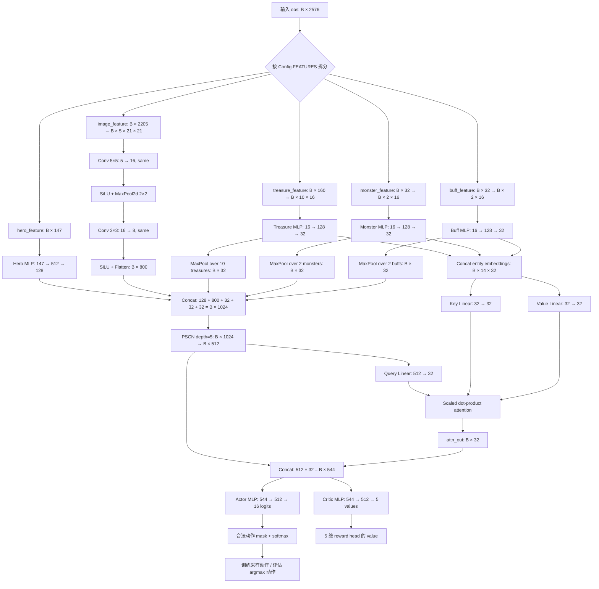
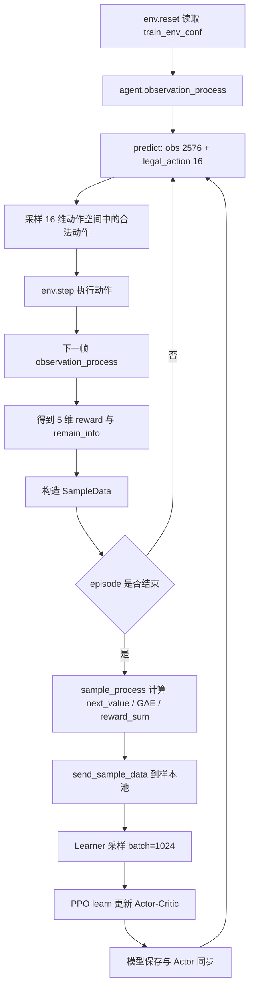

# 峡谷追逐 PPO 方案说明

## 1. 方案概述

本方案面向“路径规划 - 生存博弈”赛题：智能体控制鲁班七号在 128×128 栅格地图中躲避最多 2 个怪物追击，并尽可能收集宝箱和加速 buff。任务最终得分由生存步数得分与宝箱得分共同决定，其中步数得分为 `完成步数 × 1.5`，每个宝箱额外提供 `100` 分。环境动作空间包含 16 个离散动作：8 个普通移动动作和 8 个闪现动作；闪现直线方向可跨越 10 格，斜向可跨越 8 格，并且闪现路径上的宝箱和 buff 可以被收集。

方案主体仍采用 PPO，但不再使用 baseline 的 40 维简化状态和 8 维移动动作，而是扩展为 2576 维结构化观测、16 维完整动作空间、多目标奖励向量和结构化 Actor-Critic 网络。策略学习到的核心能力包括：在普通阶段主动寻找宝箱和 buff；在怪物加速前预留安全距离；在怪物加速后优先选择长走廊、开阔区域和低夹击风险路径；在危险或收益足够高时使用闪现完成逃脱、转移或路径穿越。

实现位置主要在：

| 模块 | 文件 |
|---|---|
| 特征与奖励 | `workspace/code/agent_ppo/feature/preprocessor.py` |
| 样本与 GAE | `workspace/code/agent_ppo/feature/definition.py` |
| 网络结构 | `workspace/code/agent_ppo/model/model.py` |
| PPO 损失 | `workspace/code/agent_ppo/algorithm/algorithm.py` |
| Agent 推理与动作处理 | `workspace/code/agent_ppo/agent.py` |
| 训练工作流 | `workspace/code/agent_ppo/workflow/train_workflow.py` |
| 方案配置 | `workspace/code/agent_ppo/conf/conf.py`、`workspace/code/conf/configure_app.toml`、`workspace/code/agent_ppo/conf/train_env_conf.toml` |

## 2. 特征工程

### 2.1 总体特征布局

方案输入为一个长度为 `2576` 的一维 `float32` 向量，由五个连续片段拼接而成。特征既包含全局进度、英雄状态、怪物威胁、宝箱/buff 目标，也包含 21×21 局部地图的多通道图像表达。

| 起止维度（1-based） | 维度数 | 特征片段 | 形状 | 含义 |
|---:|---:|---|---|---|
| 1–147 | 147 | `hero_feature` | `[147]` | 英雄自身状态、阶段信息、移动历史、危险程度、探索状态、拓扑摘要、动作历史、方向 one-hot 等综合标量特征。 |
| 148–307 | 160 | `treasure_feature` | `[10, 16]` | 最多 10 个宝箱的结构化特征；每个宝箱 16 维，按 active、visible、距离、方向等排序。 |
| 308–339 | 32 | `monster_feature` | `[2, 16]` | 最多 2 个怪物的结构化特征；每个怪物 16 维，按距离从近到远排序。 |
| 340–371 | 32 | `buff_feature` | `[2, 16]` | 最多 2 个加速 buff 的结构化特征；每个 buff 16 维。 |
| 372–2576 | 2205 | `image_feature` | `[5, 21, 21]` 展平 | 以英雄为中心的 21×21 局部图像特征，包含通行性、宝箱、buff、怪物和怪物风险热力图。 |

### 2.2 `hero_feature` 详细组成

`hero_feature` 是最核心的低维状态摘要，共 147 维。前 53 维为连续标量，后 94 维为离散状态 one-hot。

| 维度（hero 内部，1-based） | 名称 | 取值/归一化 | 含义 |
|---:|---|---|---|
| 1 | `center_row_open_ratio` | `[0,1]` | 局部 21×21 地图中心行的可通行比例，表示水平方向通路是否开阔。 |
| 2 | `center_col_open_ratio` | `[0,1]` | 局部地图中心列的可通行比例，表示垂直方向通路是否开阔。 |
| 3 | `flash_cd_norm` | `flash_cd / 2000` 截断 | 闪现冷却时间归一化。 |
| 4 | `flash_ready` | `0/1` | 闪现是否可用。 |
| 5 | `buff_remain_norm` | `buff_remain / 50` 截断 | 加速 buff 剩余时间归一化。 |
| 6 | `has_speed_up` | `0/1` | 当前是否处于加速状态。 |
| 7 | `step_norm` | `step_no / 2000` 截断 | 当前局内步数进度。 |
| 8 | `step_score_norm` | `step_score / 3000` 截断 | 生存步数得分归一化。 |
| 9 | `treasure_score_norm` | `treasure_score / 1000` 截断 | 宝箱得分归一化。 |
| 10 | `total_score_norm` | `total_score / 4000` 截断 | 总得分归一化。 |
| 11 | `flash_count_norm` | `flash_count / 100` 截断 | 本局已使用闪现次数归一化。 |
| 12 | `collected_buff_norm` | `collected_buff / 20` 截断 | 本局已收集 buff 次数归一化。 |
| 13 | `is_new_cell` | `0/1` | 当前 8×8 粗粒度地图格是否首次到达。 |
| 14 | `monster_interval_norm` | `monster_interval / 2000` 截断 | 第二只怪物出现间隔归一化。 |
| 15 | `monster_speed_norm` | `monster_speed / 5` 截断 | 当前怪物速度配置归一化。 |
| 16 | `speedup_eta_norm` | `steps_to_speedup / 2000` 截断 | 距离怪物加速还剩多少步。 |
| 17 | `speedup_step_norm` | `monster_speedup_step / 2000` 截断 | 怪物加速配置步数归一化。 |
| 18 | `recent_new_cell_ratio` | `[0,1]` | 最近窗口内进入新粗格子的比例，衡量探索是否有效。 |
| 19 | `min_monster_dist_norm` | `[0,1]` | 最近怪物距离归一化；越小越危险。 |
| 20 | `second_monster_dist_norm` | `[0,1]` | 第二近怪物距离归一化。 |
| 21 | `min_monster_delta_norm` | `Δdist / 0.25` 截断到 `[-1,1]` | 最近怪物距离变化；正值表示正在拉开距离。 |
| 22 | `fastest_monster_speed_norm` | `[0,1]` | 视野内/已知怪物中最快速度归一化。 |
| 23 | `nearest_monster_in_view` | `0/1` | 最近怪物是否在 21×21 视野内。 |
| 24 | `nearest_monster_exists` | `0/1` | 最近怪物是否存在。 |
| 25 | `danger_level` | `1 - min_monster_dist_norm` | 当前危险程度。 |
| 26 | `max_corridor_norm` | `[0,1]` | 8 个方向中最长直线可通行距离归一化。 |
| 27 | `visible_treasure_ratio` | `[0,1]` | 活跃宝箱中当前可见宝箱比例。 |
| 28 | `visible_buff_ratio` | `[0,1]` | 活跃 buff 中当前可见 buff 比例。 |
| 29 | `local_escape_density` | `[0,1]` | 半径 3 局部区域可通行密度，衡量逃生空间。 |
| 30 | `avg_corridor_norm` | `[0,1]` | 8 个方向可通行距离平均值。 |
| 31 | `corridor_variance` | `≥0` | 8 个方向通路长度方差，表示方向差异。 |
| 32 | `revisit_ratio` | `[0,1]` | 最近位置窗口中重复访问当前格子的比例。 |
| 33 | `current_cell_visit_norm` | `visit_count / 6` 截断 | 当前粗格访问次数归一化。 |
| 34 | `frontier_unvisited_ratio` | `[0,1]` | 当前粗格邻域中未访问粗格比例。 |
| 35 | `move_dx_norm` | `move_dx / 10` 截断到 `[-1,1]` | 上一步 x 位移归一化。 |
| 36 | `move_dz_norm` | `move_dz / 10` 截断到 `[-1,1]` | 上一步 z 位移归一化。 |
| 37 | `move_dist_norm` | `move_dist / 10` 截断 | 上一步实际移动距离。 |
| 38 | `recent_delta_x_norm` | 最近 10 步净 x 位移归一化 | 判断是否在原地绕圈或有效转移。 |
| 39 | `recent_delta_z_norm` | 最近 10 步净 z 位移归一化 | 判断是否在原地绕圈或有效转移。 |
| 40 | `recent_net_displacement_norm` | 最近 10 步净位移归一化 | 衡量最近窗口内真实空间推进。 |
| 41 | `last_action_is_flash` | `0/1` | 上一动作是否为闪现动作。 |
| 42 | `last_action_is_move` | `0/1` | 上一动作是否为普通移动动作。 |
| 43 | `blocked_or_stale_or_pincer` | `[0,1]` | `invalid_move_flag`、同粗格停留、夹击风险三者最大值。 |
| 44 | `min_treasure_dist_norm` | `[0,1]` | 最近活跃宝箱距离归一化。 |
| 45 | `nearest_buff_dist_norm` | `[0,1]` | 最近活跃 buff 距离归一化。 |
| 46 | `current_degree4_norm` | `degree4 / 4` | 当前已知地图中四邻接可通行度。 |
| 47 | `current_dead_end_flag` | `0/1` | 当前格是否为已知死胡同。 |
| 48 | `current_branch_flag` | `0/1` | 当前格是否为已知分岔点。 |
| 49 | `reachable_frontier_count_norm` | `/16` 截断 | BFS 范围内可达未知边界数量。 |
| 50 | `nearest_frontier_path_dist_norm` | `/48` 截断 | 到最近未知边界的路径距离。 |
| 51 | `nearest_frontier_rel_x_norm` | `/48` 截断到 `[-1,1]` | 最近未知边界相对 x。 |
| 52 | `nearest_frontier_rel_z_norm` | `/48` 截断到 `[-1,1]` | 最近未知边界相对 z。 |
| 53 | `frontier_path_revisit_cost_norm` | `/3` 截断 | 去最近未知边界路径上的重复访问代价。 |
| 54–59 | `flash_cd_bucket` | 6 维 one-hot | 闪现冷却桶：`≤0`、`≤20`、`≤80`、`≤200`、`≤500`、`>500`。 |
| 60–64 | `buff_remain_bucket` | 5 维 one-hot | buff 剩余时间桶：`≤0`、`≤10`、`≤25`、`≤40`、`>40`。 |
| 65–70 | `speedup_eta_bucket` | 6 维 one-hot | 怪物加速倒计时桶：`≤0`、`≤20`、`≤60`、`≤120`、`≤240`、`>240`。 |
| 71–76 | `monster_speed_bucket` | 6 维 one-hot | 怪物速度桶：`≤0.5`、`≤1.5`、`≤2.5`、`≤3.5`、`≤4.5`、`>4.5`。 |
| 77–87 | `remaining_treasure_count` | 11 维 one-hot | 当前剩余活跃宝箱数量，范围 `0–10`。 |
| 88–98 | `total_treasure` | 11 维 one-hot | 本局配置的总宝箱数量，范围 `0–10`。 |
| 99–101 | `speedup_phase` | 3 维 one-hot | 怪物阶段：加速前、加速临近、加速后。 |
| 102–104 | `active_monster_count` | 3 维 one-hot | 已存在怪物数量，范围 `0–2`。 |
| 105–107 | `visible_monster_count` | 3 维 one-hot | 视野内怪物数量，范围 `0–2`。 |
| 108–123 | `last_action_one_hot` | 16 维 one-hot | 上一动作编号，覆盖 8 个移动和 8 个闪现。 |
| 124–131 | `nearest_monster_dir_one_hot` | 8 维 one-hot | 最近怪物相对方向，东、东北、北、西北、西、西南、南、东南。 |
| 132–139 | `nearest_treasure_dir_one_hot` | 8 维 one-hot | 最近活跃宝箱相对方向。 |
| 140–147 | `nearest_buff_dir_one_hot` | 8 维 one-hot | 最近活跃 buff 相对方向。 |

### 2.3 宝箱特征

最多缓存并排序 10 个宝箱，每个宝箱 16 维。宝箱不仅使用当前可见信息，还通过缓存机制保留曾经见过但当前不在视野内的宝箱位置；当宝箱得分增加但宝箱不在视野内时，会将离英雄最近的缓存宝箱标记为已收集。这让策略具备一定的地图记忆能力，而不是只能依赖当前 21×21 视野。

| 宝箱内部维度 | 名称 | 含义 |
|---:|---|---|
| 1 | `exists` | 该槽位是否存在宝箱记录。 |
| 2 | `active` | 宝箱是否仍可收集。 |
| 3 | `visible` | 宝箱是否在当前 21×21 视野内。 |
| 4 | `rel_x_norm` | 宝箱相对英雄 x 坐标，按视野半径 10 归一化到 `[-1,1]`。 |
| 5 | `rel_z_norm` | 宝箱相对英雄 z 坐标，按视野半径 10 归一化到 `[-1,1]`。 |
| 6 | `dist_norm` | 宝箱距离归一化；可见时优先使用环境距离桶，否则使用相对欧氏距离。 |
| 7 | `danger_norm` | 宝箱附近的怪物危险度；越接近怪物越高。 |
| 8 | `priority` | 宝箱优先级，近距离高、危险度高时降低，近似为 `(1 - dist_norm) × (1 - 0.5 × danger_norm)`。 |
| 9–16 | `direction_one_hot8` | 宝箱相对方向 one-hot，8 个方向。 |

### 2.4 怪物特征

最多记录 2 个怪物，并按距离从近到远排序。若怪物不在视野内，则相对坐标置 0，但保留环境提供的距离桶和方向信息，从而在不可见时仍能根据方位和距离桶做规避。

| 怪物内部维度 | 名称 | 含义 |
|---:|---|---|
| 1 | `exists` | 怪物是否存在。 |
| 2 | `in_view` | 怪物是否在 21×21 视野内。 |
| 3 | `rel_x_norm` | 可见时的相对 x 坐标归一化；不可见时为 0。 |
| 4 | `rel_z_norm` | 可见时的相对 z 坐标归一化；不可见时为 0。 |
| 5 | `dist_norm` | 怪物距离归一化；可由距离桶或局部欧氏距离得到。 |
| 6 | `dist_delta_norm` | 最近怪物的距离变化，正值表示远离怪物；第二只怪物该维为 0。 |
| 7 | `speed_norm` | 怪物速度归一化。 |
| 8–16 | `direction_one_hot9` | 怪物相对方向 one-hot，包含 0=重叠/无效 与 8 个方向。 |

### 2.5 buff 特征

buff 特征与宝箱特征一致，同样最多 2 个，每个 16 维，并带有缓存、可见性、距离、危险度与方向信息。buff 的价值在本方案中不仅是移动速度提升，还与后续躲避怪物、保持长距离转移和加速阶段生存直接相关。

| buff 内部维度 | 名称 | 含义 |
|---:|---|---|
| 1 | `exists` | 该槽位是否存在 buff 记录。 |
| 2 | `active` | buff 是否可拾取。 |
| 3 | `visible` | buff 是否在当前视野内。 |
| 4 | `rel_x_norm` | buff 相对 x 坐标归一化。 |
| 5 | `rel_z_norm` | buff 相对 z 坐标归一化。 |
| 6 | `dist_norm` | buff 距离归一化。 |
| 7 | `danger_norm` | buff 附近怪物危险度。 |
| 8 | `priority` | buff 优先级，综合距离与危险度。 |
| 9–16 | `direction_one_hot8` | buff 相对方向 one-hot。 |

### 2.6 局部图像特征

局部图像特征来自英雄周围 21×21 视野，共 5 个通道，展平后 2205 维。它补足了标量特征难以表达的空间结构，使网络可以学习障碍物分布、怪物压迫区域和目标相对位置。

| 通道 | 形状 | 含义 | 具体值 |
|---:|---|---|---|
| 0 | `21×21` | 地图通行性 | 可通行为 1，障碍物为 0。 |
| 1 | `21×21` | 宝箱层 | 可见宝箱所在格写入其 active 值。 |
| 2 | `21×21` | buff 层 | 可见 buff 所在格写入其 active 值。 |
| 3 | `21×21` | 怪物位置层 | 怪物所在格写入强度，越危险强度越高；不可见怪物会画在视野边缘方向上。 |
| 4 | `21×21` | 怪物风险热力层 | 以怪物位置为中心，在 5×5 范围扩散风险强度，距离越远衰减越大。 |

### 2.7 特征工程体现的策略知识

这套特征设计把“闪现、避怪、吃宝箱、生存到怪物加速后”几个目标放进同一个状态表达中。闪现相关特征不仅包含冷却和上一动作，还包含合法动作掩码、距离变化、走廊长度和危险阶段；宝箱和 buff 特征不仅关心距离，还计算目标附近的怪物危险度；地图特征不仅包含局部通行性，还维护已知地图、粗格访问、前沿探索、死胡同和分岔点。这使策略可以形成更接近人类的判断：安全时追收益，危险时拉距离，怪物加速临近时提前找开阔区域，陷入夹击时用闪现转移。

## 3. 奖励设计

### 3.1 奖励向量结构

本方案不是单一标量价值，而是使用 5 维奖励向量：

| 奖励头 | 名称 | 目标 |
|---:|---|---|
| 1 | `score` | 生存得分、宝箱得分、接近宝箱、发现宝箱。 |
| 2 | `buff` | 拾取 buff、接近 buff。 |
| 3 | `safety` | 保持与怪物距离、提前应对怪物加速、避免危险区域。 |
| 4 | `explore` | 合理闪现、避免卡墙、避免反复绕圈、保持净位移。 |
| 5 | `terminal` | 被怪物抓住时的终局惩罚。 |

网络 Critic 输出 5 维 value，与 5 维 reward 对齐；PPO 更新时将 5 个 advantage 求和并标准化作为策略优势，同时价值损失仍对 5 维回报进行拟合。

### 3.2 基础奖励项明细

| 奖励项 | 公式/数值 | 触发条件 | 作用 |
|---|---:|---|---|
| `survive_reward` | `+0.008` | 每一步 | 提供稳定生存正反馈。 |
| `reveal_treasure_reward` | `0.08 × new_active_treasures` | 新发现活跃宝箱 | 鼓励探索地图并发现可收集目标。 |
| `step_progress_reward` | `0.004 × max(delta_step_score, 0)` | 生存得分增加 | 与环境步数得分对齐，鼓励活得更久。 |
| `treasure_reward` | `0.02 × max(delta_treasure_score, 0)` | 宝箱得分增加 | 强化实际吃到宝箱的行为。 |
| `buff_reward` | `0.02 × 100 × delta_buff_count` | buff 数量增加 | 奖励拾取 buff。 |
| `dist_shaping` | `0.08 × (min_monster_dist_norm - prev_min_monster_dist_norm)` | 每步 | 远离最近怪物给正奖励，靠近给负奖励。 |
| `treasure_progress_reward` | `0.025 × max(prev_min_treasure_dist_norm - min_treasure_dist_norm, 0)` | 最近怪物距离 `>0.20` 且存在宝箱 | 安全时鼓励靠近宝箱。 |
| `buff_progress_reward` | `0.025 × max(prev_min_buff_dist_norm - nearest_buff_dist_norm, 0)` | 最近怪物距离 `>0.20` 且存在 buff | 安全时鼓励靠近 buff。 |
| `danger_penalty` | `-0.03 - 0.005 × min(danger_steps, 6)` | 最近怪物距离 `<0.15` | 对连续处于近怪危险区强惩罚。 |
| `danger_penalty` | `-0.01` | 最近怪物距离在 `[0.15,0.25)` | 对中等危险距离惩罚。 |
| `danger_penalty` 追加 | `-0.015` | 怪物已加速且最近距离 `<0.25` | 加速后更严格避怪。 |
| `stuck_penalty` | `-0.02` | 执行动作但位置未变化 | 惩罚撞墙、卡障碍或无效移动。 |
| `revisit_penalty` | `-0.01 × max(revisit_ratio - 0.5, 0)` | 近期重复到达同一格较多 | 减少原地绕圈。 |
| `net_disp_scrape_penalty` | `-0.1 × (5 - recent_net_displacement) / 5` | 最近 10 步净位移小于 5 | 惩罚“刮墙式”低效移动。 |
| `second_monster_pressure_penalty` | `-0.015 × (0.30 - second_dist) / 0.30` | 第二只怪物存在且距离 `<0.30` | 处理双怪夹击压力。 |
| `terminal_reward` | `-(5.0 + 0.3 × remaining_treasures)` | 被怪物抓住 | 终局失败惩罚，没吃完宝箱时惩罚更大。 |

### 3.3 宝箱阶段奖励

方案将宝箱收集拆成“发现、靠近、收集、后期继续收集”几类信号，避免只在吃到宝箱时才得到稀疏奖励。

| 奖励项 | 公式/逻辑 | 触发条件 | 说明 |
|---|---|---|---|
| `reveal_treasure_reward` | `0.08 × 新发现宝箱数` | 发现新的 active 宝箱 | 鼓励探索视野外区域。 |
| `treasure_progress_reward` | `0.025 × 接近最近宝箱的距离改善` | 安全距离下 | 提供朝宝箱移动的稠密信号。 |
| `late_treasure_progress_reward` | `(0.012 + 0.02 × treasure_completion_pressure) × 接近改善` | 存在安全宝箱窗口 | 宝箱越接近收集完，继续追剩余宝箱的奖励越高。 |
| `late_treasure_progress_reward` 追加 | `+0.006 × 接近改善` | 怪物加速临近 | 鼓励加速前完成可行宝箱路线。 |
| `late_treasure_progress_reward` 追加 | `+0.012 × 接近改善` | 怪物已加速 | 在仍安全时允许继续追宝箱。 |
| `late_treasure_reward` | `0.004 × delta_treasure_score × treasure_completion_pressure` | 实际吃到宝箱 | 越接近清空宝箱，边际奖励越大。 |
| `late_treasure_reward` 追加 | `+0.0015 × delta_treasure_score` | 怪物加速临近 | 加速前吃到宝箱额外奖励。 |
| `late_treasure_reward` 追加 | `+0.003 × delta_treasure_score` | 怪物已加速 | 加速后安全吃宝箱也给额外奖励。 |

其中 `treasure_completion_pressure = 1 - remaining_treasure_ratio`，表示宝箱完成度越高，越鼓励补完剩余宝箱。`safe_treasure_window` 要求存在活跃宝箱、最近怪物距离大于 0.18，并且怪物未加速或当前有足够开阔度/长走廊。

### 3.4 怪物加速前后的奖励切换

怪物加速是本赛题的关键阶段。方案在加速前后使用不同的奖励组合：加速前更重视得分、宝箱、buff 和探索；加速后更重视生存、走廊、开阔区域和夹击风险。

| 阶段 | reward 向量 | 组成 |
|---|---|---|
| 加速前 | `[pre_score_reward, pre_buff_reward, pre_safety_reward, pre_explore_reward, terminal_reward]` | 得分和目标驱动更强，鼓励吃宝箱、拿 buff，同时保持基本安全。 |
| 加速后 | `[post_score_reward, post_buff_reward, post_safety_reward, post_explore_reward, terminal_reward]` | 生存与路径质量权重提高，强调长走廊、开阔区域、反夹击和远离怪物。 |

加速临近或已加速时，额外引入：

| 奖励项 | 公式/逻辑 | 作用 |
|---|---|---|
| `speedup_buffer_reward` | 加速临近时奖励最近怪物距离超过 `0.30`、第二怪物距离超过 `0.35`；加速后奖励最近怪物距离超过 `0.25` | 提前拉开距离，避免怪物提速瞬间被追上。 |
| `corridor_reward` | 加速临近时奖励 `max_corridor_norm > 0.35` 和 `local_escape_density > 0.45`；加速后进一步奖励最长走廊、平均走廊和局部可通行密度 | 促使智能体寻找长通道和开阔区域。 |
| `pincer_penalty` | `-0.04 × pincer_risk` | 双怪从相反方向逼近时惩罚夹击局面。 |
| `trap_penalty` | 对低 `local_escape_density` 和低 `local_inner_density` 惩罚 | 避免进入死角、小房间和容易被堵住的区域。 |
| `post_speedup_survival_bonus` | `+0.01 + 距离怪物的额外奖励` | 加速后持续生存正反馈。 |

### 3.5 闪现奖励

闪现是方案中的高级动作。奖励没有简单鼓励“多用闪现”，而是奖励“有效闪现”：闪现后拉开怪物距离、获得宝箱/buff、接近目标或进入更好的走廊；无效闪现则惩罚。

| 奖励项 | 公式/逻辑 | 触发条件 | 作用 |
|---|---|---|---|
| `flash_escape_reward` | `0.08 × escape_gain` | 使用闪现且最近怪物距离增加 | 奖励真正拉开怪物距离的闪现。 |
| `flash_escape_reward` 追加 | `0.02 × delta_treasure_score / 100` | 加速前闪现后吃到宝箱 | 学习用闪现穿越路径、顺路拿宝箱。 |
| `flash_escape_reward` 追加 | `0.02 × treasure_progress` | 加速前闪现后接近宝箱 | 学习用闪现缩短去宝箱路线。 |
| `flash_escape_reward` 追加 | `0.02 × delta_buff_count` | 加速前闪现后拿到 buff | 学习闪现拿 buff。 |
| `flash_escape_reward` 追加 | `0.02 × buff_progress` | 加速前闪现后接近 buff | 学习闪现向 buff 转移。 |
| `flash_escape_reward` 追加 | `0.07 × escape_gain + 0.03 × max(max_corridor_norm - 0.25, 0)` | 加速临近或加速后使用闪现 | 强化危急阶段通过闪现进入更好逃生通道。 |
| `flash_penalty` | `-0.02` | 闪现后没有拉开距离且没有吃到宝箱 | 抑制浪费闪现。 |

### 3.6 奖励设计总结

这套奖励不是单纯最大化即时得分，而是把“得分收益”和“长期生存”分阶段平衡。前期通过宝箱、buff、探索和闪现收益鼓励模型主动发育；中期通过加速倒计时和安全缓冲引导模型提前拉开距离；后期通过走廊、开阔度、夹击风险和终局惩罚迫使模型选择可持续逃生路线。因此模型既能吃宝箱，也能在怪物加速后尽量躲避追击。

## 4. 神经网络结构

方案使用结构化 Actor-Critic 网络。输入的 2576 维特征会先被拆成英雄标量、宝箱实体、怪物实体、buff 实体和局部图像五个分支。实体分支共享“逐实体 MLP + max pooling”的思想，图像分支使用卷积提取空间信息，随后用 PSCN 融合为 512 维上下文，再通过 attention 从宝箱、怪物、buff 实体 embedding 中读取最相关的 32 维实体上下文。最终拼接得到 544 维策略特征，同时输出 16 维动作 logits 和 5 维价值估计。



Actor 输出 16 维 logits，对应 8 个移动动作和 8 个闪现动作。训练时从合法动作 mask 后的概率分布中随机采样，评估时选择概率最大的合法动作。Critic 输出 5 维 value，与 5 维奖励头对齐，分别拟合 score、buff、safety、explore、terminal 的回报。

## 5. PPO 与训练流程

### 5.1 PPO 超参数

| 参数 | 数值 | 说明 |
|---|---:|---|
| `GAMMA` | `0.995` | 折扣因子，更重视长期生存和后期收益。 |
| `LAMDA` | `0.95` | GAE 参数。 |
| `INIT_LEARNING_RATE_START` | `5e-5` | AdamW 学习率。 |
| `BETA_START` | `0.01` | 熵正则权重。 |
| `VF_COEF` | `1.0` | 价值损失权重。 |
| `GRAD_CLIP_RANGE` | `0.5` | 梯度裁剪阈值。 |
| `DUAL_CLIP` | `3.0` | PPO ratio 上界裁剪。 |
| `CLIP_PARAM_MIN` | `0.2` | PPO 下界裁剪范围。 |
| `CLIP_PARAM_MAX` | `0.28` | PPO 上界裁剪范围。 |
| `ACTION_NUM` | `16` | 8 移动 + 8 闪现。 |
| `VALUE_NUM` | `5` | 5 个奖励/价值头。 |
| Optimizer | `AdamW(lr=5e-5, eps=1e-5, weight_decay=1e-2)` | 带权重衰减的优化器。 |

### 5.2 样本字段

| 字段 | 形状 | 含义 |
|---|---|---|
| `obs` | `[2576]` | 当前观测特征。 |
| `legal_action` | `[16]` | 当前合法动作 mask。 |
| `act` | `[1]` | 实际采样并执行的动作。 |
| `reward` | `[5]` | 当前步 5 维 reward。 |
| `reward_sum` | `[5]` | GAE 后的 5 维回报目标。 |
| `done` | `[1]` | 是否终止；异常/死亡终止会切断 bootstrap。 |
| `value` | `[5]` | 当前状态 value。 |
| `next_value` | `[5]` | 下一状态 value。 |
| `advantage` | `[5]` | GAE advantage。 |
| `prob` | `[16]` | 执行动作时旧策略概率分布。 |

### 5.3 GAE 计算

轨迹结束后执行后处理：

```text
next_value[t] = value[t+1] × (1 - done[t])
delta[t] = reward[t] + gamma × next_value[t] - value[t]
gae[t] = delta[t] + gamma × lambda × (1 - done[t]) × gae[t+1]
reward_sum[t] = gae[t] + value[t]
```

如果 episode 是正常达到最大步数而非死亡或异常截断，则最后一步会使用当前模型对最后状态估计 `last_next_value` 进行 bootstrap；如果是死亡或异常截断，则 `done=1`，不再 bootstrap。

### 5.4 PPO 损失

训练时模型重新计算当前策略概率与 value：

```text
prob_dist = masked_softmax(logits, legal_action)
ratio = new_action_prob / old_action_prob
adv_scalar = normalize(sum(advantage_heads))
policy_loss = -mean(min(clipped_ratio × adv, ratio_clipped × adv))
value_loss = 0.5 × mean((reward_sum - value_pred)^2)
entropy_loss = mean(entropy(prob_dist))
total_loss = value_loss + policy_loss - beta × entropy_loss
```

其中 `legal_action` 会把非法动作概率压到极小值，保证训练和推理都不会选择当前不可执行的动作。由于动作空间包含闪现，闪现冷却未完成时，对应 8 个闪现动作会被 mask 掉。

### 5.5 环境与训练配置

| 配置项 | 当前值 | 说明 |
|---|---:|---|
| 地图 | `[1,2,3,4,5,6,7,8,9,10]` | 使用全部开放地图。 |
| `map_random` | `true` | 每局随机地图，提高泛化。 |
| `treasure_count` | `10` | 每局最多宝箱。 |
| `buff_count` | `2` | 每局 2 个加速 buff。 |
| `buff_cooldown` | `200` | buff 刷新时间。 |
| `talent_cooldown` | `200` | 闪现冷却时间。 |
| `monster_interval` | `200` | 第二只怪物出现时间。 |
| `monster_speedup` | `300` | 怪物加速时间。 |
| `max_step` | `2000` | 单局最大步数。 |

训练基础配置如下：

| 配置项 | 当前值 | 说明 |
|---|---:|---|
| `replay_buffer_capacity` | `16384` | 样本池容量。 |
| `preload_ratio` | `0.5` | 样本池达到一半后启动训练。 |
| `reverb_remover` | `Fifo` | 旧样本按先进先出移除。 |
| `reverb_sampler` | `Uniform` | Learner 均匀采样。 |
| `reverb_rate_limiter` | `MinSize` | 达到最小样本量后全速训练。 |
| `train_batch_size` | `1024` | Learner 单次训练 batch。 |
| `dump_model_freq` | `100` | 每 100 次训练保存模型参数。 |
| `model_file_sync_per_minutes` | `1` | Learner 与 Actor 每分钟同步模型。 |
| `preload_model` | `false` | 当前不启用预加载模型。 |

### 5.6 训练/验证切分与课程学习

当前配置启用了训练/验证切分：训练地图和验证地图都使用 1–10 号开放地图，且均随机抽图；每 10 个 episode 执行 1 个验证 episode。课程学习配置文件中定义了 warmup、mid pressure、late speedup survival、hard generalization 四个阶段，可以逐步改变宝箱数、buff 数、第二怪出现时间、怪物加速时间和最大步数，但当前 `enabled=false`，实际训练使用固定环境配置。

| 机制 | 当前状态 | 作用 |
|---|---|---|
| 训练/验证切分 | 开启 | 周期性用验证 episode 监控泛化和真实表现。 |
| 课程学习 | 配置存在但关闭 | 可在需要时逐步提高环境压力。 |
| 每局随机地图 | 开启 | 降低对单地图路径的过拟合。 |
| 定期保存 | 工作流每 900 秒保存一次，框架每 100 train step dump | 保留训练中间模型。 |

### 5.7 训练数据流



## 6. 相比 baseline 的关键提升

| 方向 | baseline | 本方案 |
|---|---|---|
| 动作空间 | 8 维，仅普通移动 | 16 维，完整支持移动 + 闪现。 |
| 特征维度 | 40 维简化特征 | 2576 维结构化特征。 |
| 地图表达 | 4×4 局部通行性 | 5 通道 21×21 局部图像 + 已知地图拓扑缓存。 |
| 宝箱/buff | baseline 基本未建模 | 显式建模最多 10 个宝箱和 2 个 buff，带缓存、危险度和优先级。 |
| 怪物 | 简单位置/距离 | 距离变化、速度、方向、可见性、双怪夹击、加速阶段。 |
| 奖励 | 生存 + 远离怪物 | 5 头奖励：得分、buff、安全、探索、终局。 |
| 网络 | 简单 MLP + actor/critic | 多分支编码、CNN、实体 pooling、attention、PSCN 融合。 |
| 训练监控 | 基础 reward/loss | 训练/验证 episode 指标、分阶段 reward、闪现、危险、宝箱、buff、加速后表现等。 |

## 7. 方案效果背后的直观解释

该方案能够取得高分，核心原因是把赛题中的高价值行为拆成了可学习的中间目标。吃宝箱不再只是稀疏的 `+100` 结果，而被拆成“发现宝箱、接近宝箱、安全窗口内继续追宝箱、吃到宝箱”；躲怪不再只是“离怪物远”，而包含距离趋势、第二怪压力、加速倒计时、长走廊、局部开阔度、夹击风险和死胡同识别；闪现不再只是一个额外动作，而被奖励塑造成“逃生、穿越、拿资源、进入更好地形”的高级技能。最终模型学到的是一种阶段化策略：前期主动收集资源，中期在收益和安全之间权衡，怪物加速前后迅速转向生存优先，并在关键时刻用闪现完成高价值转移。
